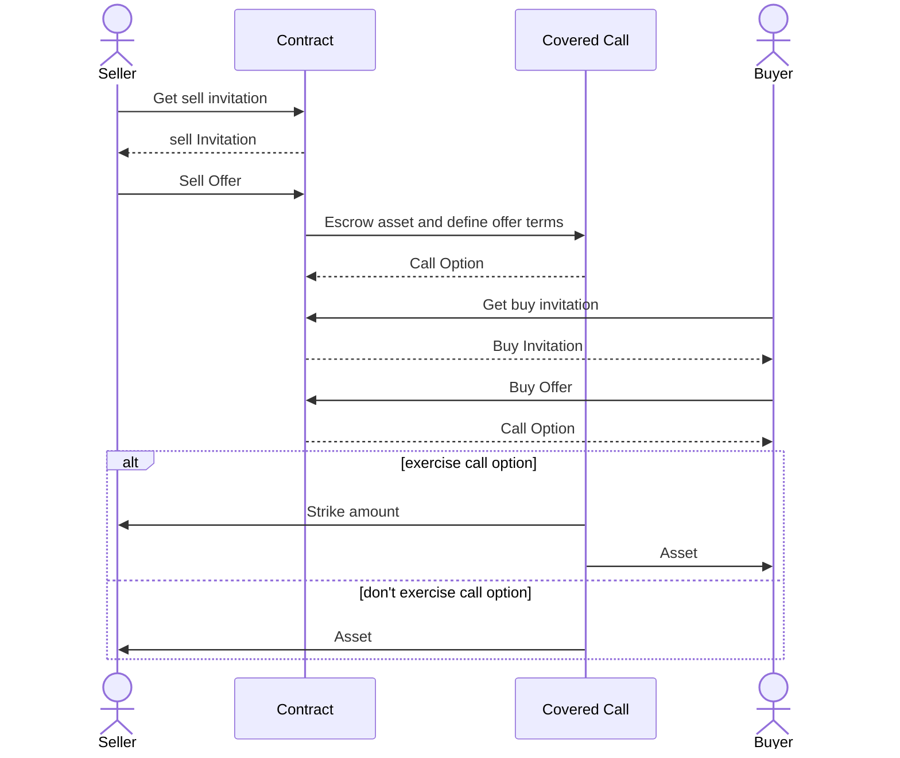

# Lecture Eight - Assignment
## Assignment Description

1. Build a new Agoric project
2. Create a new contract that allows the user to sell a call option of a certain asset belonging to him;
3. Use the Agoric contract coveredCall to generate the call option; `*`
4. Create the following tests:
    - sell call option;
    - buy and exercise the call option before deadline;
    - buy and exercise the call option after deadline;

`* https://github.com/Agoric/agoric-sdk/blob/f29591519809dbadf19db0a26f38704d87429b89/packages/zoe/src/contracts/coveredCall.js`

## Sequence diagram

