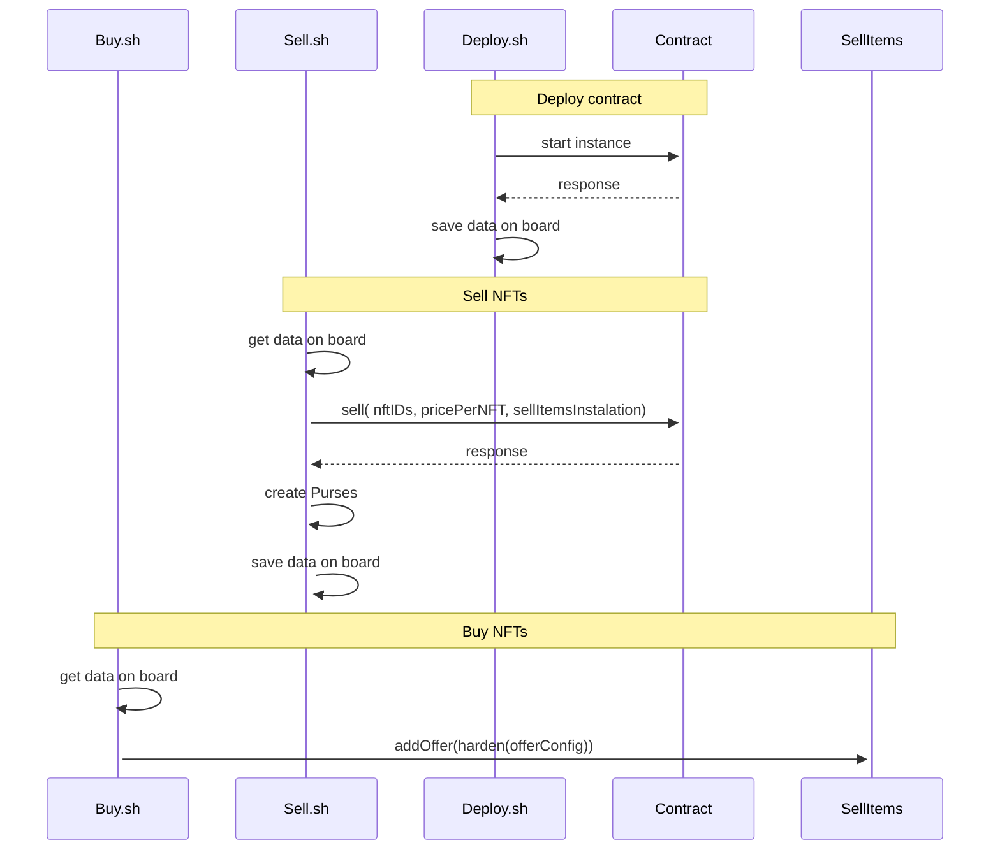

# Lecture Five - Assignment
## Assignment Description:

1. Import your project developed for assignment 4
2. build 3 deploy scripts:
    - deploy.js (deploy contract at local chain)
    - sell.js (sell nft)
    - buy.js (buy nft)

## Sequence diagram

