# Lecture Five - REPL and Deploy Scripts
## Table of Contents
* `home` object: REPL or Deploy Scripts?
  * REPL
  * Deploy Script
* `home` Object for Dapp Developers
  * Holding on to your objects: `Board` vs `Scratch`?
  * NameHub: `agoricNames`, `namesByAddress`
  * `zoe`!
  * Sending offers in a non-test environment: `wallet` and `walletBridge`
  * Timers: `localTimerService` vs `chainTimerService`?
* Demos
  * Deploy Script as a CLI Client
  * Send Payments to Another User

## `home` object: REPL or Deploy Scripts?

Blockchain networks are useless without their users. There has to be an agent that represents the user
in the context of programs. In Agoric, that agent is called `ag-solo`. Each `ag-solo` has its own `vat`. This
is how it can interact with components that live in other `vats`. When we think about blockchain ecosystem in
general, the agent representing users in the network is called `wallet`. Agoric has its own implementation wallet too.
And yes, that wallet is deployed inside the `ag-solo`.

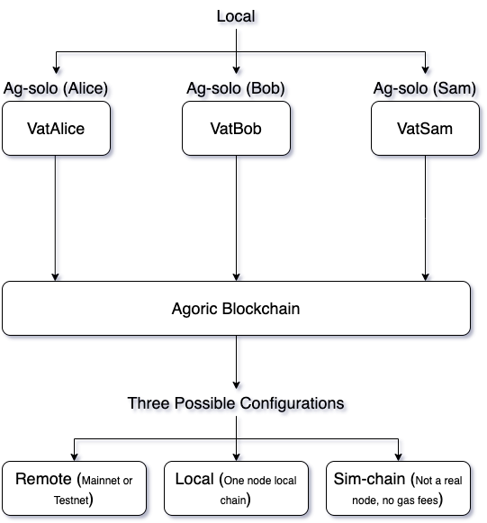

_Figure 1: Shows possible configurations of the agents_

In the diagram above, users are represented in their own `ag-solos`:
* Ag-solo (Alice)
* Ag-solo (Bob)
* Ag-solo (Sam)

And these users interact with a blockchain, the possible configurations for an Agoric Blockchain is:
* Sim-Chain
* Local One Node Chain
* Remote Chain: Mainnet or Testnet

Considering the time I spent on Agoric, the best development experience for a dapp developer is `Local One Node Chain`
because you get to run your code in an actual node and not get blocked by network related problems.

In the following lectures we'll focus on how to spin up `Local One Node Chain`.


### What's the `home` object?
`home` is the root object for tools that let the `ag-solo` interact with the network and other users. This `home`
object is available from two places:
1. REPL
2. Deploy Scripts

### REPL
**R**ead-**E**val-**P**rint-**L**oop - REPL is integrated inside your wallet UI. Recall that since the beginning of 
the course we've used the below command to access our wallet UI:

```sh
agoric open --repl
```

The flag `--repl` here indicates that we want the REPL accessible in our wallet UI. Here's a screenshot of the `home`
object accessed from REPL;

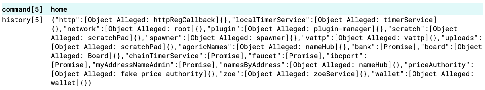

Some of the objects you see living in `home` objects are internal for `ag-solo`, others are deprecated and some are
very useful for dapp developers. We'll focus on the last type.

For a full list of which is which please see the [REPL Docs](https://docs.agoric.com/reference/repl/).

### Deploy Scripts
In Blockchain ecosystem, the term `deploy script` indicates a script that developers use to deploy their smart-contracts
to the blockchain network they're building on. In Agoric, this is only one feature of a deploy script. 

**_Deploy scripts have full access to the `home` object._**

Recall that `home` object has a number of useful tools for dapp developers. Hence, there's no reason why we cannot
use deploy scripts for purposes other than deploying smart-contracts. We'll discover what we can do with a deploy script
in a few live demos later in this lecture. For now, let's focus on:

**What makes a `deploy script`?**

Agoric CLI has a subcommand called `deploy`. This deploy script accepts any number of scripts as its arguments and 
executes them in order. For instance;

```shell
agoric deploy scriptOne.js scriptTwo.js scriptThree.js
```

Above sample command will execute all three scripts in the order of;
1. scriptOne.js 
2. scriptTwo.js 
3. scriptThree.js

Great. But;

**Can `agoric deploy` execute any JS script?**

No, it has to follow the below structure:

```js
const scriptOne = async (homeP, others) => {
  const home = await homeP;
  console.log({ home, others });
};

export default scriptOne;
```

`agoric deploy` invokes every script with two arguments;
1. `homeP`: A promise for the `home` object
2. `others`: Some host related helper objects like `bundleSource` which we're using for bundling our contracts and 
`pathResolve` which we use to resolve the path to our contracts

**!!! Important !!!:** If you wish to execute a script using `agoric deploy`, you must `export default` the method
you wish to execute. In the example above, the method we wish to execute is `scriptOne`, therefore we add;

```js
// ...
export default scriptOne;
```

to the last line.

## `home` Object for Dapp Developers
As we said earlier `home` object contains so many tools. Some of them are for internal uses, some of them are deprecated as the agoric-sdk
is under development and some of them are very useful for the dapp developers. Let's explore how we can use those helpful tool for 
dapp developers.

### Holding on to your objects: `Board` vs `Scratch`?
`Hardened JavaScript` is a `OCaps` enforcing environment. Which means that once you lose the reference to an object, you lose that 
capability. `home` object offers two options for storing objects;

1. Board
2. Scratch

Let's think about a possible scenario where we have objects we might want to hold on:

```js
const {
  publicFacet,
  creatorFacet,
  instance,
} = await E(zoe).startInstance(
  installation,
);
```

And in our imaginary contract let's say the content for `publicFacet` and `creatorFacet`:
```js
const publicFacet = Far('Public Facet', {
  hello: () => 'Hello from Public Facet!!!',
});

const creatorFacet = Far('Creator Facet', {
  dangerous: () => zcf.shutdown(),
});
```

By convention, we expect powerful methods like `dangerous` above to be in the `creatorFacet`. So as the creator of this imaginary contract
we should hold on to the `creatorFacet`, but in the same time we should let our users interact with our `publicFacet`. Looks like we need
two separate places to store our objects;
* One for **Public Objects**
* One for **Private Objects**

Agoric offer two storage places for these needs: `Board` is for PUBLIC storage and `Scratch` is for PRIVATE storage.

If we want to make use of `home` object for our imaginary scenario in a sample deploy script, it would look like below:

```js
const scriptOne = async (homeP, { pathResolve }) => {
  const home = await homeP;

  const {
    publicFacet,
    creatorFacet,
    instance,
  } = await E(zoe).startInstance(
    installation
  );
  
  const [publicFacetBoardId, creatorFacetScratchId] = await Promise.all([
    E(home.board).getId(publicFacet),
    E(home.scratch).set('creator_facet_scratch_id', creatorFacet)
  ]);

  const dappConstants = {
    publicFacetBoardId,
    creatorFacetScratchId
  };
  const defaultsFile = pathResolve(`./generated/dappConstants.js`);
  console.log('writing', defaultsFile);
  const defaultsContents = `\
// GENERATED FROM ${pathResolve('./scriptOne.js')}
export default ${JSON.stringify(dappConstants, undefined, 2)};
`;

  await fs.promises.writeFile(defaultsFile, defaultsContents);
};

export default scriptOne;
```

When we break the code, below is where we put `creatorFacet` and `publicFacet` into storage:

```js
const [publicFacetBoardId, creatorFacetScratchId] = await Promise.all([
    E(home.board).getId(publicFacet),
    E(home.scratch).set('creator_facet_scratch_id', creatorFacet)
  ]);
```

* `E(home.board).getId(publicFacet)` puts the value to the `board` if it doesn't already exist and returns the generated unique id, 
if the value exists it only returns the id. `publicFacet` is PUBLIC because it's stored in `board`.
* `E(home.scratch).set('creator_facet_scratch_id', creatorFacet)` takes a key and value pair as arguments, returns the key. `creatorFacet` 
is PRIVATE because it's stored in `scratch`.

Please see the full docs at;
* [Board API Reference](https://docs.agoric.com/reference/repl/board.html)
* [Scratch Reference](https://docs.agoric.com/reference/repl/scratch.html#e-home-scratch-set-id-obj)

After we put our objects to storage, we must keep the keys in a safe place. That is, mostly, writing it to local file. 
In the script above, the filename is `dappConstant.js`. Anybody who has access to this local file might query those objects from
REPL because `Deploy Scripts` and `REPL` share the same `home` object. For instance, let's say the board id for the `publicFacet`
is 'board0371'. The `publicFacet` can be queried from **any** `ag-solo` like this:

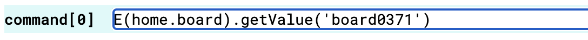

Only the `ag-solo` that `agoric deploy` is connected to, can query the `creatorFacet` because `home.scratch` is private:

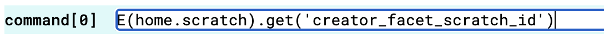

### NameHub: `agoricNames`, `namesByAddress`
`NameHubKit` is a data structure, implemented by Agoric team, where it enables users to store/query objects based on a name hierarchy.  

A `NameHubKit` has two components;
* `NameHub` for reading data
* `NameAdmin` for writing access

Do not forget to check out full list methods with their explanations and the source code of `NameHubKit` from `NameHubKit Documentation`
section below.

`home` object offers two instances of `NameHub`: `agoricNames` and `namesByAddress`,

And one instance of `NameAdmin`: `myAddressNameAdmin` which is the `NameAdmin` for `namesByAddress`.

#### `agoricNames`
Notice that normal users do not have write access to `agoricNames`. Why?

`agoricNames` is a special instance of `NameHub` where access to the core Agoric components can be obtained by the user.
Since allowing any user to write such an important object might cause some security issues for the whole network, users
do not get a `NameAdmin` for `agoricNames`.
 
**What's inside the `agoricNames`?**

If we want to see the contents of `agoricNames`, we could do this:

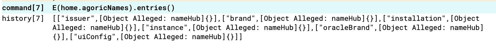

Notice that a nested array is returned where the first element of the inner array is the `key` and the second element is
a `nameHub` instance. That means we could do something like this:

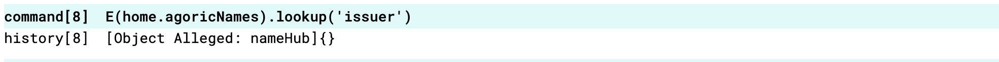

And query the returned `nameHub` in the same way that we did query `agoricNames`:

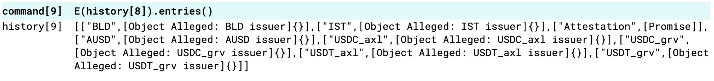

`lookup` method also lets you set a path as the arguments, so something like below is possible:

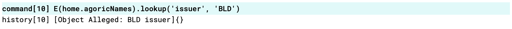

It's possible to pass 3 or 4 arguments to `lookup` where the level of nested array is that deep.

#### namesByAddress
`namesByAddress` is also a `NameHub` instance but not for access to network wide core components but for user's personal
storage. You can access the `NameAdmin` for your own ag-solo from `myAddressNameAdmin`. Let's go over an example scenario;

> **Important:** One important thing to note here is that users get to see all other users `NameHubs`, but they can
> only write to their own. This is possible due to the nested structure of the `NameHubs`.

Imagine Alice has an important object that she only wants to share with Bob. Since Agoric is an OCaps environment
this is a very likely scenario. How can she share her reference to this important object with Bob?

Let's say there's a smart contract implemented just for this purpose, which is also very likely, with a source code
like:

```js
const start = () => {
  const importantObjects = [];

  const creatorFacet = Far('Important Object Receiver', {
    receiveNew: newImportantObject => {
      importantObjects.push(newImportantObject);
    },
    readImportantObjects: () => {
      return [...importantObjects];
    }
  });

  return { creatorFacet };
};
```

> **Note:** [Source code of above contact.](../codeSamples/contract/src/lectureFive/objectReceiver.js) 

In the above contract we only expose `creatorFacet` because we want to make sure that only people who know Bob's 
address should be able to share objects with Bob. Bob is going to start this contract and put it's `creatorFacet`
to his `nameHub`. He can do this all-in-one deploy script. A sample deploy script might be like:

```js
const shareImportantObject = async (homeP , endowments) => {
  const { myAddressNameAdmin, zoe } = E.get(homeP);
  const { install } = await makeHelpers(homeP, endowments);

  console.log('Installting objectReceiver contract...');
  const { installation } = await install(
    '../../contract/src/lectureFive/objectReceiver.js',
    'Object Receiver Contract'
  );

  console.log('Starting objectReceiver contract...');
  const {
    creatorFacet: objectReceiverCreatorFacet
  } = await E(zoe).startInstance(
    installation
  );

  console.log('Putting objectReceiverCreatorFacet to namesByAddress...');
  await E(myAddressNameAdmin).update('objectReceiver', objectReceiverCreatorFacet);

  console.log('Done.');
};

export default shareImportantObject;
```

> **Note:** [Source code of the deploy script.](../codeSamples/api/lectureFive/shareImportantObject.js)

> **Caution:** `E.get()` allows fetching objects from a Promise without waiting for it to resolve.

**What's happening in the deploy script?**

The code until **line 23** in the source code is for installing the contract and starting the instance. 
See [deploy-script-support](https://github.com/Agoric/agoric-sdk/tree/65d3f14c8102993168d2568eed5e6acbcba0c48a/packages/deploy-script-support).

The part we're interested in is:

```js
console.log('Putting objectReceiverCreatorFacet to namesByAddress...');
await E(myAddressNameAdmin).update('objectReceiver', objectReceiverCreatorFacet);
```

Notice;
* We use [eventual-send](https://github.com/endojs/endo/tree/master/packages/eventual-send)(E) because deploy script
is not in the same `vat` as the `myAddressAdmin`
* We use `update` method to initialize a new object
* We tell Bob what we are doing via a `console.log` 

Once above script is executed, anybody who knows Bob's address can share objects with him. Interacting with the shared
object from REPL might look like this:

> **Note:** I spinned up a sim-chain so my user's address in `sim-chain-client`.

> **Note:** Since we're on a sim-chain, we act like bot Bob and Alice.

Query the `objectReceiver`;

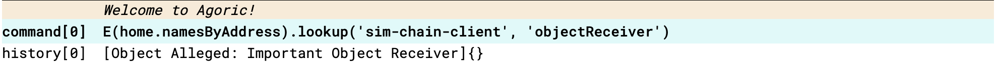

Check contents;

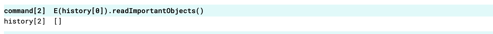

Create `topSecret` and send it to Bob;

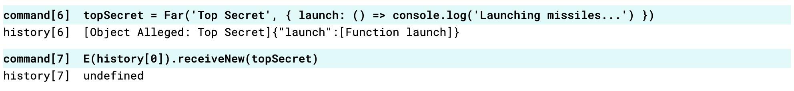

Fetch `topSecret` and launch missiles;

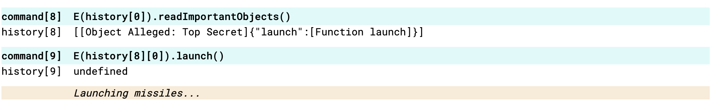


This is how you can send objects to other users in a private manner. We'll cover how to send payments to other users 
in the live demo.

#### NameHubKit Documentation
* [NameHub API Reference](https://github.com/Agoric/agoric-sdk/blob/65d3f14c8102993168d2568eed5e6acbcba0c48a/packages/vats/src/types.js#L14-L30)
* [NameAdmin API Reference](https://github.com/Agoric/agoric-sdk/blob/65d3f14c8102993168d2568eed5e6acbcba0c48a/packages/vats/src/types.js#L32-L57)
* [NameHubKit Source Code](https://github.com/Agoric/agoric-sdk/blob/65d3f14c8102993168d2568eed5e6acbcba0c48a/packages/vats/src/nameHub.js)

### `zoe`!
Recall that `zoe` has two sides;
1. `ZoeService` mostly for client purposes
2. `ZoeContractFacet` offers a toolset for smart-contract developers

When we think inside the context of REPL and Deploy Scripts, it's obvious we're the client side. This means that 
what `home` object offers us as `zoe` is actually the `ZoeService`. Please feel free to check out whole 
[ZoeService API Reference](https://docs.agoric.com/reference/zoe-api/zoe.html). All methods in `ZoeService` API are
working in both REPL and Deploy Scripts. I just want to touch on a few methods that I see commonly used:

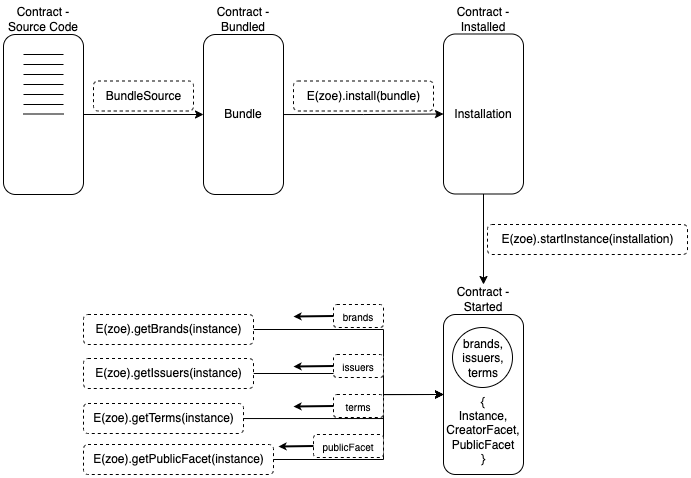

_Figure 2: Shows Zoe's commonly used methods from Deploy Scripts and REPL_

As `Zoe` is the contract host for the Agoric Network, all contract deployed to this host should do it in the same
way. There are two main methods:

1. `E(home.zoe).install()`
2. `E(home.zoe).startInstance()`

Once we've successfully installed and instantiated a contract, there are several actions we can perform with a reference
to the contract's instance;

1. `E(home.zoe).getBrands(instance)` and `E(home.zoe).getIssuers(instance)` 
2. `E(home.zoe).getTerms(instance)`
3. `E(home.zoe).getPublicFacet(instance)`

Do not forget to see the whole [ZoeService API Reference.](https://docs.agoric.com/reference/zoe-api/zoe.html)

### Sending offers in a non-test environment: `wallet` and `walletBridge`
Offer Safety is one of the most important aspects of Agoric in terms of the value it brings to the table.
So far we've only seen one way to send offers, that is;

```js
const userSeat = await E(zoe).offer(
  invitation,
  proposal,
  payment,
  offerArgs, // Optional
);
```

* **invitation:** Holds a reference to the `offerHandler`, required
* **proposal:** User specifies what they want and what they're willing to pay in return, required if there's going to 
be a right transfer in the offer
* **payment:** The actual asset user is paying, required if there's `give` property in the proposal
* **offerArgs:** Business logic specific data, optional

Let's imagine a scenario where we want some `Moola` fungible assets in exchange for some amount of `Quatloos` fungible
assets. We could execute the corresponding offer in a unit test like below:

```js
const {
  brand: quatloosBrand,
  mint: quatloosMint
} = makeIssuerKit('Quatloos');

const quatloosAmount = AmountMath.make(quatloosBrand, 100n);
const moolaAmount = AmountMath.make(moolaBrand, 200n);

const proposal = {
  give: { Price: quatloosAmount },
  want: { Asset: moolaAmount }
};

const payment = {
  Price: quatloosMint.mintPayment(quatloosAmount),
};

const userSeat = await E(zoe).offer(
  E(publicFacet).makeAssetInvitation(),
  proposal,
  payment,
);
```

Notice that we minted required payment on the go by invoking `quatloosMint.mintPayment(quatloosAmount)`. Would this be
possible in a real network environment? No, it's not possible. If it was possible, it would mean that you're able to
print money. There's no blocking technical reason for this, but it's still a long shot that people would trade an asset
you can print. Alright then, how can one get their hands on a payment?

**Enter `home.wallet`**

Recall that in the earlier sections we talked about how to turn an electronical right into an eright by implementing
the ERTP interface. ERTP includes components like;

* Issuer
* Mint
* Purse

And the list goes on. See [ERTP API Reference](https://docs.agoric.com/reference/ertp-api/) for full documentation.
`wallet` objects grants access to some of the most important components of ERTP API from a user standpoint. Especially;
* **Purse:** Where payments are stored.
* **Payment:** The actual money.

Here are the related methods;
* `E(home.wallet).addPayment(payment)`
* `E(home.wallet).getIssuers()`
* `E(home.wallet).getIssuer(petname)`
* `E(home.wallet).getPurses()`
* `E(home.wallet).getPurse(petname)`

> Note: [Definition of Petname](https://docs.agoric.com/glossary/#petname)

See [Wallet API Reference](https://docs.agoric.com/reference/wallet-api.html#wallet-api-commands) for full list of 
methods.

Let's try to send this desired offer from a deploy script using `home.wallet` object;

```js
/**
 * We assume;
 * - All board ids are already known
 * - All petnames are known
 */
const sendOfferUsingWalletAPI = async homeP => {
  const { zoe, board, wallet } = E.get(homeP);
  const quatloosPursePetname = 'Quatloos Purse';
  const moolaPursePetname = 'Moola Purse';
  
  // Get values from board
  const [
    quatloosBrand,
    moolaBrand,
    publicFacet, // Public Facet of imaginary contract that is going to do the trade
  ] = await Promise.all([
    E(board).getValue(QUATLOOS_BRAND_BOARD_ID),
    E(board).getValue(MOOLA_BRAND_BOARD_ID),
    E(board).getValue(PUBLIC_FACET_BOARD_ID),
  ]);
  
  // Build offer
  const quatloosAmount = AmountMath.make(quatloosBrand, 100n);
  const moolaAmount = AmountMath.make(moolaBrand, 200n);
  
  const proposal = harden({
    give: { Price: quatloosAmount },
    want: { Asset: moolaAmount }
  });
  
  // Get purses
  const quatloosPurseP = E(wallet).getPurse(quatloosPursePetname);
  const moolaPurseP = E(wallet).getPurse(moolaPursePetname);
  
  // Get payment
  const quatloosPayment = await E(quatloosPurseP).withdraw(quatloosAmount);
  
  const payment = harden({
    Price: quatloosPayment
  });
  
  const userSeat = E(zoe).offer(
    E(publicFacet).makeAssetInvitation(),
    proposal,
    payment
  );
  
  // Make sure offer is successful, this will throw if there was an uncatched error when executing the offer
  await E(userSeat).getOfferResult();
  
  // Get payout
  const moolaPayment = await E(userSeat).getPayout('Asset');
  
  // Put moola into purse
  await E(moolaPurseP).deposit(moolaPayment);
};

export default sendOfferUsingWalletAPI;
```

Let's break down the above code step-by-step;
1. We fetch references to the required objects from the `board`
2. We create the proposal with `Amounts`
3. We fetch purses to the desired assets from our wallet
4. We withdraw from `quatloosPurse` the amount of `quatloos` we specified in our `give` section of the proposal
5. We build the payment
6. We send the offer
7. Check everything went alright
8. Withdraw what we wanted from the `userSeat`
9. Deposit the withdrawn `moola` to the `moolaPurseP`

Can you sense some anti-pattern in the above code? What happened to the "No developers should get their hands on 
to any payment in the code"? Yeah, something's wrong here. Although this might be a useful approach for demos, this
is not a production approach. So what is the solution then?

**Enter `walletBridge`**

`walletBridge` provides an API for untrusted dapps to let them interact with the wallet and therefore, the assets
in the wallet. See [WalletBridge API Reference](https://docs.agoric.com/reference/wallet-api.html#walletbridge-api-commands)
for full list of available methods. 

In Web3, almost every dapp asks for user to connect their wallet. In Agoric, this is also the case. Dapps ask for
approval from users so that they can do their job. Approving a dapp means;
* A `walletBridge` instance specific to that dapp is created and returned to the dapp
* User's wallet now knows that dapp

The term `bridge` is used because it sits between the full features of `home.wallet` and the dapp. Every offer
sent via `walletBrdige` is subject to user approval. These offer requests show up on the Wallet UI's `Dashboard`.
The end-to-end flow can be seen in the below diagram:

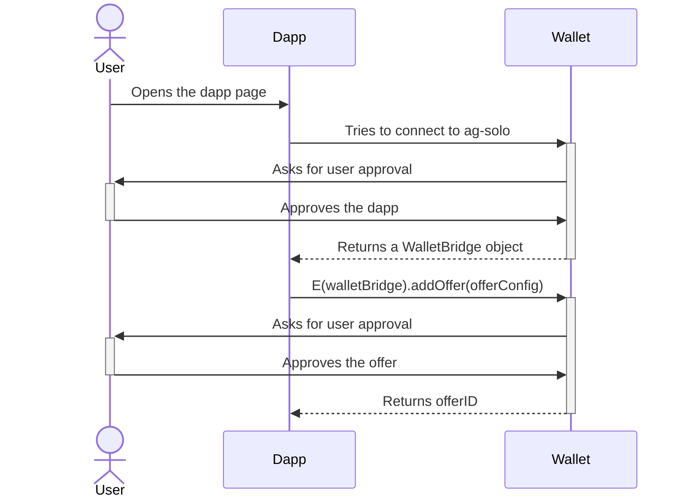

Now, let's try to update the anti-pattern code into a safe CLI client to our wallet:

```js
/**
 * We assume;
 * - All board ids are already known
 * - All petnames are known
 */
const safeOfferClient = async homeP => {
  const { board, wallet } = E.get(homeP);
  const quatloosPursePetname = 'Quatloos Purse';
  const moolaPursePetname = 'Moola Purse';
  
  const publicFacetP = E(board).getValue(PUBLIC_FACET_BOARD_ID);
  const walletBridge = E(wallet).getBridge();
  
  const offerConfig = {
    id: `${Date.now()}`,
    invitation: E(publicFacetP).makeBorrowInvitation(),
    installationHandleBoardId: IMAGINARY_CONTRACT_INSTALL_BOARD_ID,
    instanceHandleBoardId: IMAGINARY_CONTRACT_INSTANCE_BOARD_ID,
    proposalTemplate: {
      want: {
        Asset: {
          pursePetname: moolaPursePetname,
          value: 200n,
        },
      },
      give: {
        Price: {
          pursePetname: quatloosPursePetname,
          value: 100n,
        },
      }
    },
  };
  
  await E(walletBridge).addOffer(offerConfig);
  console.log('Offer sent.');
};

export default safeOfferClient;
```

Once we execute this script with `agoric deploy`, the code above will send the exact offer as we sent in the 
earlier sample. Notice;
* There are not `payments` flying around
* OfferHandler will be executed after the user approves offer request from Wallet UI

One more important thing to mention:

```js
const walletBridge = E(wallet).getBridge();
```

In the above line, we fetched the `walletBridge` using `getBridge` method. In the documentation, you'll also see a
`getScopedBridge` method which is what a dapp will use in a real world scenario. The difference between `getBridge` 
and `getScopedBridge` is that `E(wallet).getScopedBridge()` requires a user approval whereas
`E(wallet).getBridge()` does not. Since deploy scripts are considered trusted agents we were able to use 
`getBridge`, if we were a dapp living in a browser, and try to fetch a `walletBridge` instance from the wallet
we would have to use `getScopedBridge` instead.

**Deploy Scitps Can Mimic Client Apps**
With the usage of `wallet` you can test your contracts in a non-unit-test-environment without building a GUI.
A very useful feature for demos.

### Timers: `localTimerService` vs `chainTimerService`?
Agoric offers a shared time service across all agents of the network. Any parties doing a business that depends on time
can use this service to make sure all time passes the same for everybody. 

This shared time service is called `chainTimerService`. Agoric also offers a `localTimerService` which is mainly used
for tests. These timer services both share an identical API. The only difference between them is the _unit of time_:

* `localTimerService` interprets time **milliseconds**.
* `chainTimerService` interprets time **seconds**.

[See the full docs on timer services.](https://docs.agoric.com/reference/repl/timerServices.html#timerservice-objects)

When you're developing a smart contract that depends on time, the usual way to go is to accept a `timer` from the 
contract terms:

```js
const start = async zcf => {
  const {
    timer,
  } = zcf.getTerms();
};

harden(start);
export { start };
```

And in your deploy script you can inject any timer service as you like to your contract:

```js
const deploy = async homeP => {
  const { zoe, localTimerService, chainTimerService } = E.get(homeP);
  
  const sampleTermsOne = {
    timer: localTimerService
  };
  
  const sampleTermTwo = {
    timer: chainTimerService,
  };
  
  await E(zoe).startInstance(
    installation,
    issuerKeywordRecord,
    sampleTermsOne      
  );

  await E(zoe).startInstance(
    installation,
    issuerKeywordRecord,
    sampleTermsTwo
  );
};

export default deploy;
```

Both terms are valid and can be used by your contract.

There's a [manualTimer](https://github.com/Agoric/agoric-sdk/blob/65d3f14c8102993168d2568eed5e6acbcba0c48a/packages/zoe/tools/manualTimer.js)
that is very useful for testing as well. Make sure to check this out.


## Demo Time!
* Deploy Script as a CLI Client
* Sending invitation to other users privately 