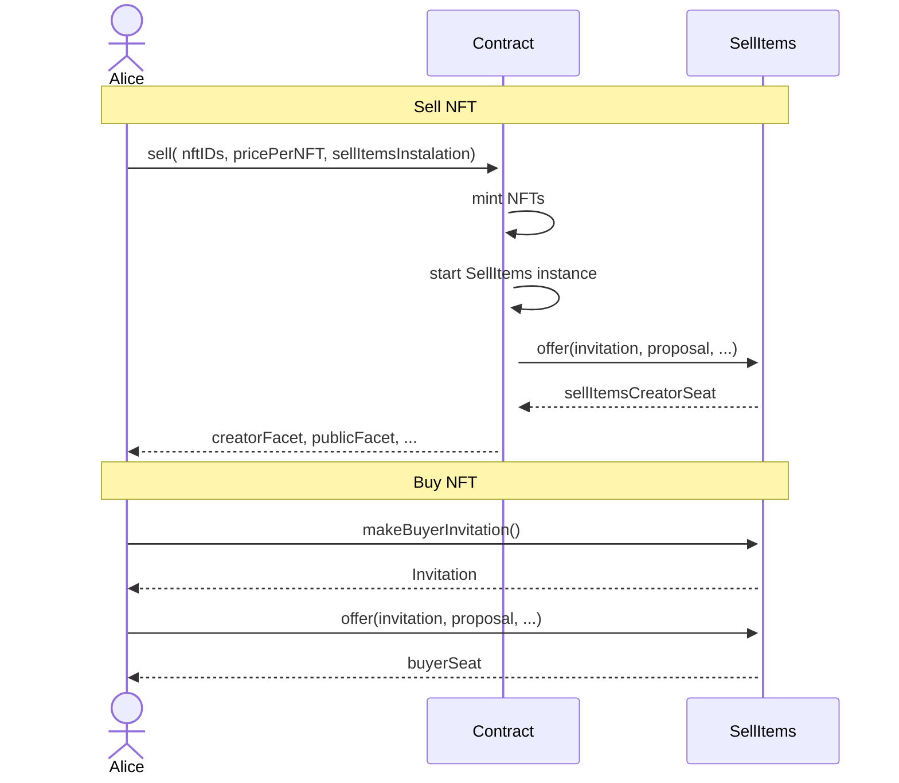

# Lecture Four - Assignment

## Assignment Description:

1. Create a new contract;
2. Mint some NFTs;
3. Create a function that allows the user to sell some of the minted NFTs to through the zoe sellItems contract;
4. Create a new test file for the contract above;

## Sequence diagram

