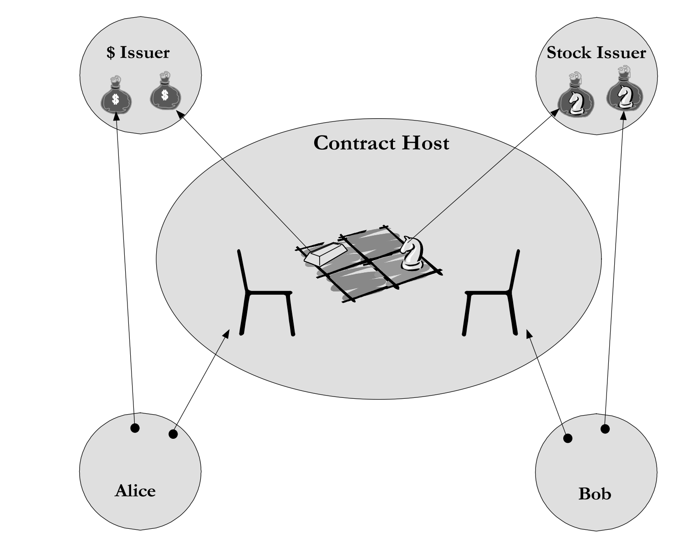

# Lecture Four - Higher-Order Smart Contracts

## Table of Content
* Understanding The Methodology of `Higher-Order` in Programming
* How Agoric Applies This `Higher-Order` Methodology
    * Derived erights
    * Invitations
    * Reusable Smart Contracts

## Understanding The Methodology of `Higher-Order` in Programming
The most concrete application of _The Methodology of `Higher-Order` Programming_ is higher order functions(HOF).
According to the [definition](https://en.wikipedia.org/wiki/Higher-order_function) a higher-order function does at least
one of the following:

* takes one or more functions as arguments
* returns a function as its result

The definition above applies for computation in general, so it covers both computer science and mathematics.

JavaScript supports higher-order functions natively. In fact it has some built in methods that uses higher-order
functions. Here are a few examples;

* Array.prototype.map()
* Array.prototype.filter()
* Array.prototype.reduce()
* ...

And the list goes on. `Array.prototype` has these higher-order methods as there are a lot of operations that programmers
might do that requires iterating over arrays. Make sure to check [this article](https://medium.com/javascript-scene/higher-order-functions-composing-software-5365cf2cbe99)
out to understanding the reasoning of these methods with some good examples.

## How Agoric Applies This `Higher-Order` Methodology
Agoric uses a few abstractions on top of the concrete higher-order functions in order to apply this methodology. We'll
focus on three examples where we can observe higher-order mindset and also how those three examples work together to form
a robust platform.

* Derived erights
* Invitations
* Reusable Smart Contracts

Let's break them down one by one.

### Derived erights
Now to understand what a `Derived eright` is and how we can make use of it, we must recall [Lecture Two](../lectureTwo/lectureTwo.md):

"*...Contracts enable the exchange of rights across these protected domains.*"[2]

 

*Figure 4: Sample Exchange Diagram[3] (From lecture two)*

In lecture two we touched on how contracts make it possible to trade rights between mutually suspicious parties. And
why a `Contract Host` is needed to make this system work. Let's imagine Alice paid Bob to hold on to an asset for some time
and she might want to buy that asset for 10 bucks before the time is up. This is a covered call option right? And after
Alice and Bob initiate this contract, the spot price of the asset starts going up. Imagine Alice now wants some other
asset which Fred happens to have, so she offers Fred to exchange her covered call option for the asset Fred posseses.
The right to buy the asset from 10 bucks is itself an eright and Alice is using this eright to trade for another asset.

This brings us to the below situation;


Remember what features an electronic right must have in order to be classified as an eright?
* Exclusive
* Assayable

In order to achieve both of the above features we must introduce a trusted third party. In ERTP we call this party
an `Issuer`. This brings us to the question: Who is the issuer of Alice's right to exercise the covered call option?

### Invitation
Invitations are, in fact, `Payment`s. Let's try to understand this design choice by trying to answer the questions below;
* Who's the issuer of invitations?
    * Does it have one issuer? Or every contract has its own invitation issuer?
* What's the `AssetKind` of these invitations?
* What kind of benefits are we getting when we create invitations as ERTP assets?

#### Who's the issuer of invitations?
Remember how to create invitations? Invitations are created using `Zoe Contract Facet` using the below method;

```js
const invitation = zcf.makeInvitation(offerHandler, 'Description', customProperties = undefined, proposalShape = undefined);
```

So this means that invitations can only be created from a contract. [Agoric Docs](https://docs.agoric.com/reference/zoe-api/zoe.html#e-zoe-getinvitationissuer)
has a useful sample like below:

```js
const invitationIssuer = await E(Zoe).getInvitationIssuer();
// Here a user, Bob, has received an untrusted invitation from Alice.
// Bob uses the trusted **InvitationIssuer** from Zoe to
// transform the untrusted invitation to a trusted one
const trustedInvitation = await invitationIssuer.claim(untrustedInvitation);
const { value: invitationValue } =
    await E(invitationIssuer).getAmountOf(trustedInvitation);
```

Above code snippet showcases how Alice approaches to an untrusted invitation. Steps she follows;
1. Get the source of trust for the invitation
2. Verify the invitation using the `issuer.claim()` method of ERTP
3. Check the data inside the verified invitation

Step one clearly answers our question of "_Who's the issuer of invitations?_", notice that we fetch the `invitationIssuer`
from Zoe. Without specifying any instance or installation or any other type of arguments. So we can confidently say
that: Zoe(Contract Host) is the issuer of all invitations.

#### What's the `AssetKind` of these invitations?
This question is already answered in the above section but in an implicit way. Notice the third argument
of `zcf.makeInvitation()`:

```js
const invitation = zcf.makeInvitation(offerHandler, 'Description', customProperties = undefined, proposalShape = undefined);
```

The argument `customProperties` is and `Object` that goes into the value of the invitation payment so that clients,
like Alice, can use its data to establish trust to the invitation itself. So we can conclude that our invitations are
`non-fungible`, this means that the assetKind is `COPY_SET`.

#### What kind of benefits are we getting when we create invitations as ERTP assets?
Let's go back to our example in the [Derived erights]() section. What would happen if Alice offered to hand over a userSeat
instead of an invitation? Could Fred trust that the userSeat is actually will return him the covered call option?
Unfortunately Fred has no way to make sure that the object Alice claims to be a seat that will return the right to
exercise the covered call option is actually what Alice says it is and not an arbitrary object. On the other hand, if
Fred gets that seat via exercising an invitation, he will have the below guatantees;

* The invite is relevant to this contract (otherwise the contract does not give a seat in return)
* The seat that is handed by the contract directly is the one that runs according to the contract

The reasoning behind Fred being able to have the above guarantees is described in [this section](https://docs.agoric.com/reference/zoe-api/zoe.html#e-zoe-getinvitationdetails-invitation)
of the Agoric docs which is showcases by below code snippet:

```js
const invitation = await invitationIssuer.claim(untrustedInvitation);
const invitationValue = await E(Zoe).getInvitationDetails(invitation);
```

Since a invitations is a non-fungible ERTP asset, we can its values are the type `Object`. Zoe lets us read the value
of a given invitation in a convenient way using `await E(Zoe).getInvitationDetails(invitation)`. Note that this
operation is equivalent of;

```js
const { value: invitationValue } = await E(invitationIssuer).getAmountOf(trustedInvitation);
```

the method above because Zoe already knows the `invitationIssuer`.

The contents of an invitaion's value is as follows:

```js
const invitationValue = {
  installation, // The contract's Zoe installation.
  instance, // The contract instance this invitation is for.
  invitationHandle, // A Handle used to refer to this Invitation.
  description, // Describes the purpose of this Invitation. Use it to match the invitation to the role it plays in the contract.
  ?customProperties, // Developer passes this for clients to do further inspections in order to achieve the trust 
}
```

Fred can use the above information to compare against the data he trusts and willing to do business with.

There's one more guarantee that an invitation provides over using a simple object. Can you imagine what it is?

* Hint: **Invitations are Payments.**

Okay we achieved the assyability thanks to the `Issuer`. What about exclusivity? Invitations are burned when offers
are exercised. Thus we can make sure one invitation is only used ONCE. So Fred can know he's the only one exercised this
right.

#### How do invitations help to achieve `Higher-Order Composition`?
So far we've been talking about how invitations work and what they actually are. Great, but how does it help from the
higher-order composition point of view?

1. First of all, when we observe how to create an invitation:
  ```js
  const invitation = zcf.makeInvitation(offerHandler, 'Description', customProperties = undefined, proposalShape = undefined);
  ```

Notice that `offerHandler` is actually a function. So invitaions make use of `Higher-Order Functions`.

2. They help us to securely trade derived erights which is a higher-order version of the underlying eright.


### Reusable Smart Contracts
Let's see some code now.
* [Funded Call Spread](https://github.com/Agoric/agoric-sdk/blob/master/packages/zoe/test/unitTests/contracts/test-callSpread.js)


## Recommended Papers
* [Reasoning about Risk and Trust in an Open Word](https://agoric.com/assets/pdf/papers/reasoning-about-risk-and-trust-in-an-open-world.pdf) <br>
* [Distributed Electronic Rights in JavaScript](https://agoric.com/assets/pdf/papers/distributed-electronic-rights-in-javascript.pdf) <br>
* [The digital path](https://agoric.com/assets/pdf/papers/digital-path.pdf)<br>

## Resources
[1] https://www.youtube.com/watch?v=iyuo0ymTt4g <br>
[2] https://www.codecademy.com/learn/game-dev-learn-javascript-higher-order-functions-and-iterators/modules/game-dev-learn-javascript-iterators/cheatsheet
<br>
[3] https://github.com/Agoric/agoric-sdk/blob/master/packages/ERTP/NEWS.md <br>
[4] https://github.com/Agoric/documentation/issues/360 <br>
[5] https://github.com/Agoric/agoric-sdk/issues/81 <br>
[6] https://agoric.com/wp-content/uploads/2022/08/Agoric-White-Paper-v1.1.pdf <br>
[7] https://docs.agoric.com/guides/js-programming/#vats-the-unit-of-synchrony <br>
[8] https://github.com/Agoric/agoric-sdk/blob/master/packages/zoe/docs/zoe-zcf.md <br>
[9] https://docs.agoric.com/reference/zoe-api/zoe.html#e-zoe-startinstance-installation-issuerkeywordrecord-terms-privateargs <br>
