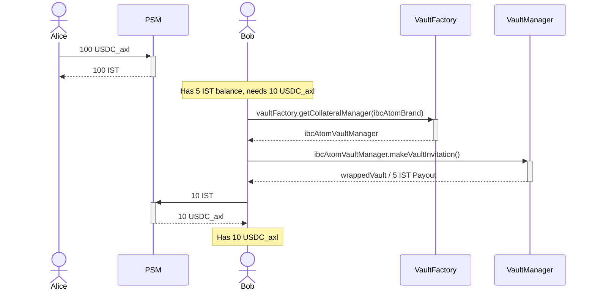

# Lecture Nine - Assignment
## Assignment Description:
In this assignment we'll interact with two important components of inter-protocol: PSM and VaultFactory.
Your assignment is to implement one or more deploy scripts to mimic client behaviors when completing the sample
scenario. The scenario is like below:
1. Alice puts 100 USDC_axl to `PSM-USDC_axl`
2. Bob has ATOM and 5 IST in his balance but he wants 10 USDC_axl
3. Bob opens a vault and receives 5 more IST in exchange for his ATOM
4. Bob now has 10 IST and he trades his IST for 10 USDC_axl in PSM

> Demonstrations will happen in a local-chain

## Sequence Diagram
