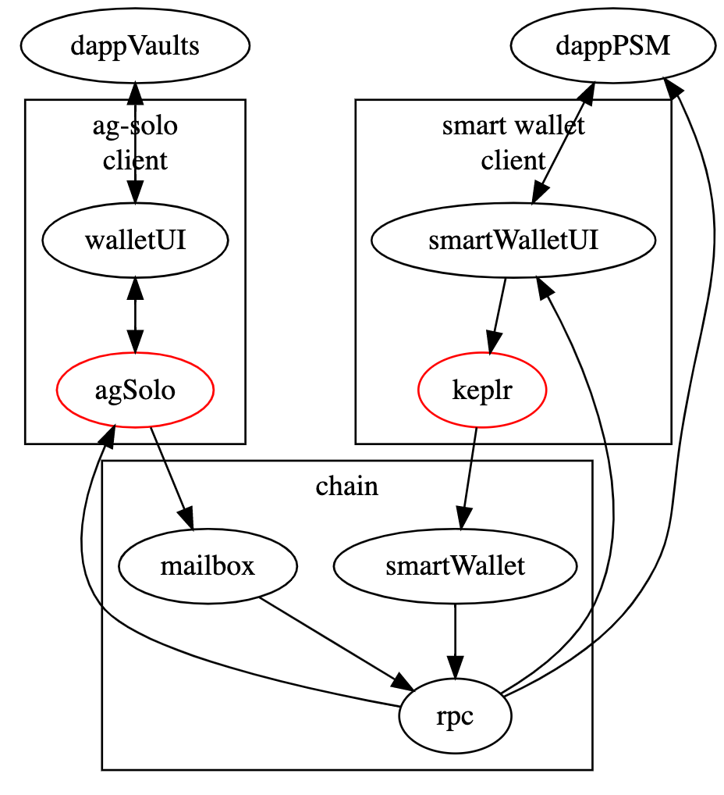
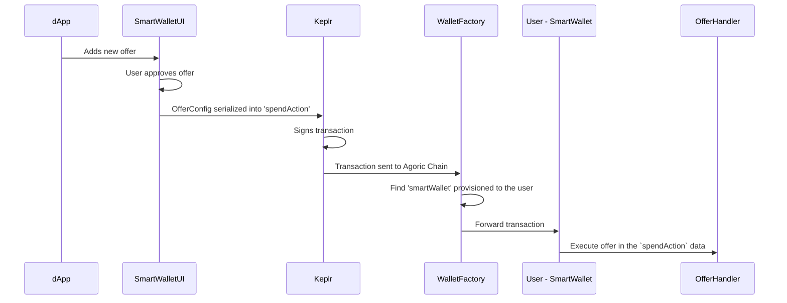
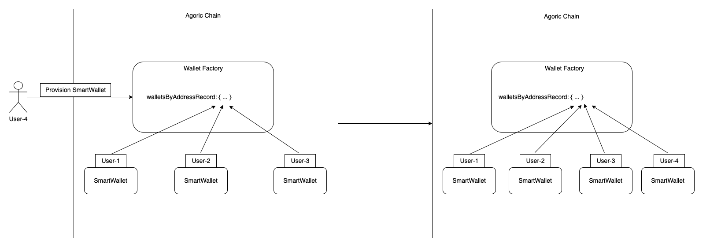
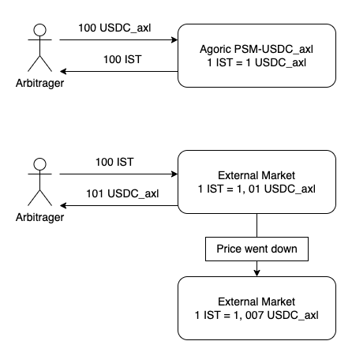
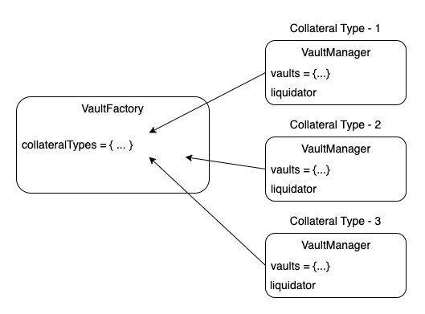
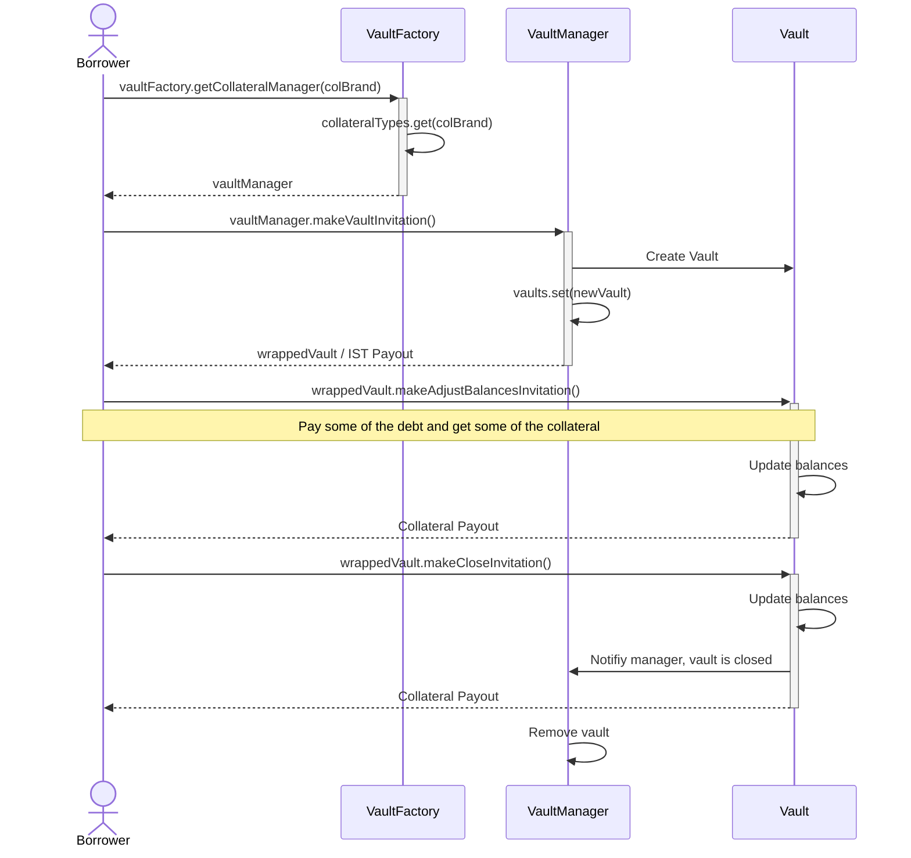
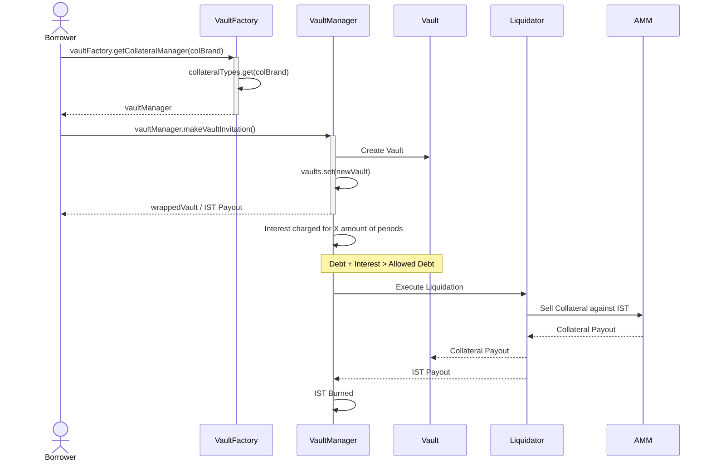
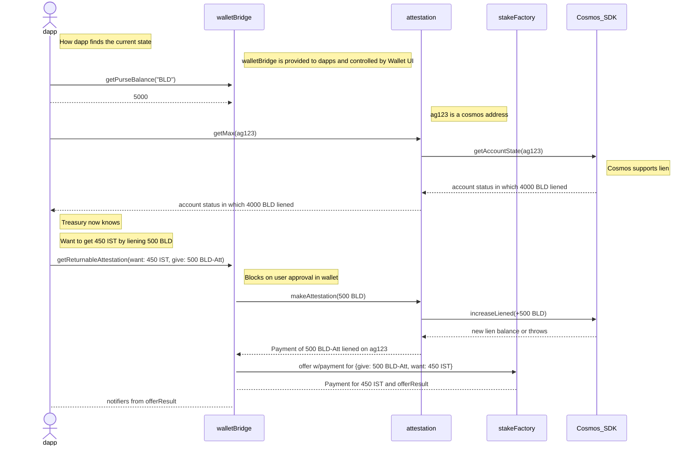

# Lecture Nine - The Inter Protocol
## Table of Contents
* Introduction
  * How does IST maintain its stability?
* Interacting with The Inter Protocol
  * Smart Wallet
* IST Minting Components
  * PSM
  * VaultFactory
  * BLD Boost
* Liquidity Safeguards
  * AMM
  * Reserve

## Introduction
Agoric aims to position itself in a unique place across all Cosmos ecosystem. The plan is to introduce Inter Stable Token
(IST) which is a native IBC compatible token soft-pegged to the US dollar. The Inter Protocol is a decentralized application
that implements the Agoric Economy around IST.

### How it works?
The Inter Protocol is a root term for multiple applications. Below diagram illustrates how these applications work together
to handle minting/burning of IST. 


> _Figure 1: [The Inter Protocol System Overview](https://docs.inter.trade/inter-protocol-system-documentation/inter-protocol-system-overview)_

The Inter Protocol is currently live on `Mainnet 1` which has `PSM` and `Smart Wallet` from the diagram only. 
Checkout [Agoric Roadmap](https://agoric.com/roadmap/) for future launches. Current version of [The Inter Protocol](https://inter.trade/)
enables users to trade stable tokens against IST in `PSM` using `Smart Wallet` and [Keplr](https://www.keplr.app/).

Agoric adopts a model that is similar to [Maker DAO](https://makerdao.com/en/). This makes IST fully collateralized by 
crypto assets. Thus, fully decentralized. The collateralization strategy is like most of the protocols crypto world, 
meaning overcollateralized. `Liquidation Margin` is a parameter that helps to calculate how much bigger the US Dollar
value of the collateral should be compared to the requested IST.

`Economic Committee` is governance parameters that are crucial to Agoric Economy. These parameters include
* Debt Limits
* Interest Rates
* Collateralization Ratio

And so on...

Who gets to be in the `Economic Committee`? Well that depends. The members of the `Ecomomic Committee` are elected by 
`BLDer DAO`. `BLDer DAO` is an umbrella term that represents `BLD` stake holders. The code for this `Economic Committee`
can be found in [committee.js](https://github.com/Agoric/agoric-sdk/blob/master/packages/governance/src/committee.js) which
is maintained under `governance` package.

> Do not forget to check out [The Inter Protocol White Paper](https://inter.trade/static/whitepaper-6106f841c1ed6c564afd2fc3238240a9.pdf)
> for more information.

### How does IST maintain its stability?

**What is a `Stable Token`?**

**Types of `Stable Token`s**

**Maintaining Stability**

## Interacting with The Inter Protocol
### Smart Wallet
If you check the _Figure 1_ you can see that `Smart Wallet` is the gateway of users to the `inter-protocol` dapps.
But until now we always interacted with Agoric Network using `ag-solo`, why `Smart Wallet` then? Notice that 
`ag-solo` is an off-chain `vat` that has access to the very powerful objects like `wallet`, `network` etc. 
Thus, the motivation for `Smart Wallet` can be listed as;

* We should not expose objects that powerful to normal users
* Not every user can run their own `ag-solo` in order to interact with Agoric Blockchain

> Note: `ag-solo` is still usable in DevNet but for `MainNet` you have to use `Smart Wallet`

Below diagram compares `Smart Walet` approach to the existing `ag-solo` approach



> _Figure 2: SmartWallet vs ag-solo. [Original Diagram.](https://github.com/Agoric/documentation/issues/726#issue-1442404880)_

A few things to note here;

* `SmartWallet` consists of two major components
  * On-chain smart contracts and helper code
  * Off-chain client code: `SmartWalletUI`
    > [SmartWallet Contract Code](https://github.com/Agoric/agoric-sdk/tree/master/packages/smart-wallet) and [Smart Wallet UI Code](https://github.com/Agoric/wallet-app)

On-chain `SmartWallet Contracts` have the following major responsibilities;
* Deal with user's balances via a special object called `bank`
* Forward offer requests coming from dapps to the actual offerHandler

> Check out [bank code](https://github.com/Agoric/agoric-sdk/blob/f41a6ce8975e5bf713734425189946e9d38d1f3f/packages/vats/src/vat-bank.js#L204) and [How does Smart-Wallet work?](https://github.com/Agoric/agoric-sdk/discussions/6934)
> discussion to learn more.

The sequence diagram below illustrates the flow in _Figure 2_ with more detail:



As you can see the `On-chain SmartWallet Contracts` is broken down into two components;
1. WalletFactory
2. SmartWallet

The relationship between `WalletFactory` and `SmartWallet` can be observed below:



## IST Minting Components

### PSM
The Parity Stability Module(PSM) is similar to [The Peg Stability Module](https://mips.makerdao.com/mips/details/MIP29#sentence-summary)
of MakerDAO. The basic idea is to mint IST against other stable coins in 1:1 ratio. BLD staker governance decides which 
stablecoins are supported as collaterals. For a given instance of `PSM`, meaning a market that mints IST against a
particular type of stablecoin, `Economic Commitee` also governs below parameters;
 
* GiveMintedFee
* MintLimit
* WantMintedFee

These parameters are `Fees` when we give/want IST to/from `PSM` module, and the other one is the total amount of IST that this
`PSM` instance can mint.

#### Idea
The idea behind `PSM` is to maintain IST's stability by presenting arbitrage opportunities whenever IST price diverges
from US dollar. This arbitrage mechanism is illustrated in below;

> Numbers used in below diagram are chosen arbitrary



#### For Developers
To third party developers who might want to integrate their dapp to `PSM`, consider taking a look at the `PSM Public Facet`;

```js
// PSM publicFacet
const publicFacet = {
  getMetrics() {},
  getPoolBalance() {},
  makeWantMintedInvitation() {},
  makeGiveMintedInvitation() {},
  ...publicMixin,
}
```
Use `makeWantMintedInvitation` when you want IST against your stabletoken and use `makeGiveMintedInvitation` when
you want your stablecoin against IST. The usage of these invitations is like what we've seen so far.

```js
const invitation = E(psmPublicFacet).makeWantMintedInvitation();

const proposal = harden({
  give: { Anchor: anchorAmount },
  want: { Minted: mintedAmount },
});

const payment = harden({
  Anchor: anchorPayment
});

const userSeat = E(zoe).offer(
  invitation,
  proposal,
  payment,
);

await E(userSeat).getOfferResult();
const istPayment = await E(userSeat).getPayout('Minted');
```

**PSM Samples**

[publicMixin](https://github.com/Agoric/agoric-sdk/blob/65d3f14c8102993168d2568eed5e6acbcba0c48a/packages/governance/src/contractHelper.js#L184-L187) 
is set of helper methods for parameters that are governed. `PSM` uses a helper for governing its parameters.

[want stable](https://github.com/Agoric/agoric-sdk/blob/65d3f14c8102993168d2568eed5e6acbcba0c48a/packages/inter-protocol/test/smartWallet/test-psm-integration.js#L123-L172)
test in `inter-protocol/test/smartWallet/test-psm-integration.js` show how `PSM` can be used with a `SmartWallet`.

[test-psm.js](https://github.com/Agoric/agoric-sdk/blob/65d3f14c8102993168d2568eed5e6acbcba0c48a/packages/inter-protocol/test/psm/test-psm.js)
contains more use cases that are related to `PSM`. Important test that showcases characteristics of `PSM`;

* [limit is for minted](https://github.com/Agoric/agoric-sdk/blob/65d3f14c8102993168d2568eed5e6acbcba0c48a/packages/inter-protocol/test/psm/test-psm.js#L341-L364)<br>
  This tests creates a `PSM` with 2 ISTs against 1 anchor coin. And wants to trade with `PSM` by `MINT_LIMIT` amount of
anchor. This transaction requires 2 * `MINT_LIMIT` of IST to be minted, so it throws with the message `'Request would exceed mint limit'`.
This demonstrates that it's not the amount of anchor that matters, but it's the amount of IST that the contract is
trying to limit.
* [mix of trades: failures do not prevent later service](https://github.com/Agoric/agoric-sdk/blob/65d3f14c8102993168d2568eed5e6acbcba0c48a/packages/inter-protocol/test/psm/test-psm.js#L374-L464)<br>
  For this test, there are helpers methods implemented to enable trading from a sequence. Basically we want to see that
if one trade fails, others can keep functioning as expected. 

### VaultFactory
`VaultFactory` is another alternative for purchasing IST. Since IST is a fully collateralized stablecoin, users can only
exchange IST against some collateral. `VaultFactory` is similar to `PSM` in this sense. The difference lies within 
the type of collateral accepted. `VaultFactory` can accept any type of ERTP asset as collateral as long as the 
`Economic Commitee` approves it whereas `PSM` only accepts stablecoins. This significant difference causes one other
major difference and that is `over-collateralization`. `PSM` trades with other stablecoins in 1:1 ratio, meaning 
the value of the collateral is equal to received IST value. Since crypto assets can be very volatile, minting IST
in a 1:1 ratio with another crypto asset would risk IST's value. Remember, IST is a fully-collateralized asset, so
we want to make sure there's enough collateral to support outstanding IST. `VaultFactory` measures this so called
`value` of the collateral in terms of US dollars. This is another mechanism that supports IST's stability.

In order to fully understand how `VaultFactory` works, we first need to understand a few terms:

* **Liquidation Margin:**
  Remember we said that the USD value of the collateral should be greater than the USD value of the debt. Well, by how much?
`Liquidation Margin` indicates this margin. Let's say you want to borrow 100 IST and the `Liquidation Margin` is 150%,
 this means that you must put at least $150 worth of collateral in order to borrow the IST you want.
* **Liquidation:**
  Let's keep the example above. Now, imagine that you borrowed your 100 IST against $150 worth of collateral.
What happens if your collateral token's value drops against USD and now your vault has only $125 of collateral. 
What's the most amount of IST you can borrow for $125 of collateral when `Liquidation Margin` is 150%?
The answer is: `125 / 1.5 = 83,3`. How much IST you possess? `100 IST`. In a situation like this, `The Inter Protocol`
considers such a loan as `under-collateralized` and acts before there's any more damage. This action is to: <ins>Sell the
borrower's collateral in another market against IST and burn the purchased IST.</ins> So that there's no IST floating around
without collateral. This action is called `Liquidation`.
* **Interest Rate:**
An interest is charged on every vault. Similar to real world.
* **Charging Period vs. Recording Period:** When you inspect `VaultFactory` code you'll notice these two timing related
similar parameters. The interest charged on every `Charging Period`. Since the amount of interest accrued per one
charge is too small, the system chooses to wait until some meaningful amount to accrue and then display to the outside
world. This period displaying accrued interest is called a `Recording Period`.

#### VaultFactory Basic Design



`VaultFactory` has a record that stores the `VaultManagers` in a key-value fashion where the `collateralBrand` is key
and the `vaultManager` is the value. The ability to create new `vaultManagers` belongs to `VaultFactory's` creatorFacet
which is controlled via `Economic Commitee`. 

`VaultManager` is where users actually interact to borrow IST. Every successful borrow results in a new `vault`. 
These `vaults` are stored in a sorted manner according to their `debt/collateral` ratio. This sorted structure 
allows `vaultManager` to keep track of under-water vaults. 

**Charging Interest**<br>
`VaultManager` implements an optimization when charging interest on loans. Imagine there are 100 vaults in a vaultManager
instance. When the chargingPeriod hits, how are you going to charge interest on all 100 loans? Iterate over 100 of them?
How would that scale? O(n). `VaultManager` does this in O(1) thanks to this smart optimization. 

`VaultManager` has a variable called `compoundedInterest`, on every chargingPeriod vaultManager updates this variable.
When a new vault is created, it gets a snapshot of this compoundedInterest. To calculate the current debt of a vault,
the vault gets a fresh compoundedInterest and calculates how much interest has accrued to this particular vault by
comparing the fresh compoundedInterest to the interestSnapshot it got when it is created. The difference between fresh
compoundedInterest and interestSnapshot is then added to the principal debt, to get the final debt of a particular vault.
Make sure to check [getCurrentDebt](https://github.com/Agoric/agoric-sdk/blob/65d3f14c8102993168d2568eed5e6acbcba0c48a/packages/inter-protocol/src/vaultFactory/vault.js#L753)
to see how a vault calculates its debt. 

**Liquidator**<br>
Liquidation happens when there's an under-water vault. The current way of liquidating vaults is to sell the collateral
against IST in the AMM. This strategy might change in future but for now this is the current design. 

Agoric's `Higher-order smart contract` nature allows several liquidation strategies to be implemented for one `vaultManager`
instance. Managers hold an instance to a `liquidator` contract. `VaultManager` is designed to work with multiple
liquidator contracts. Below are two current liquidator contracts;
* [liquidateIncrementally.js](https://github.com/Agoric/agoric-sdk/blob/65d3f14c8102993168d2568eed5e6acbcba0c48a/packages/inter-protocol/src/vaultFactory/liquidateIncrementally.js)
* [liquidateMinimum.js](https://github.com/Agoric/agoric-sdk/blob/65d3f14c8102993168d2568eed5e6acbcba0c48a/packages/inter-protocol/src/vaultFactory/liquidateMinimum.js)

[setupLiquidator](https://github.com/Agoric/agoric-sdk/blob/65d3f14c8102993168d2568eed5e6acbcba0c48a/packages/inter-protocol/src/vaultFactory/vaultManager.js#L871)
method is used to update liquidator contact that vaultManager uses.

#### Use Case 1 - Happy Path
Below diagram illustrates the "Happy Path" for user borrowing and paying their debt.


#### Use Case 2 - Debt Not Paid
This diagram on the other hand shows how the liquidation process performs when the borrower does not pay their debt.


### BLD Boost
`BLD` is the official staking token of Agoric. `BLD Boost` allows BLD stakers to borrow IST against their staked
BLD in exchange for the future staking rewards. Below diagram shows this flow:



> _Figure 3: [stakeFactory.js](https://github.com/Agoric/agoric-sdk/blob/65d3f14c8102993168d2568eed5e6acbcba0c48a/packages/inter-protocol/src/stakeFactory/README.md)_

The good part is your BLD tokens stay staked. The mechanism allowing `BLD Boost` to know you actually have the BLD
tokens staked without actually locking them inside the `BLD Boost` contract is called `attestation`. It basically
checks the account that wants to borrow IST actually has BLD staked and if it does mint a `attestation`. All this 
checking happens in Cosmos level, so it's very privileged. You can only mint attestations for tokens which have 
a registered cosmos denom. For more information on attestations you can check out [this conversation](https://github.com/anilhelvaci/dapp-pool-lending-protocol/issues/41#issuecomment-1311713263).

## Liquidity Safeguards
The Inter Protocol also has some mechanisms to ensure the economy is safe and liquid. 
### AMM
Agoric's Automated Market Maker (AMM) contributes this safety insurance by providing a market to liquidate vaults.
Apart from its role in VaultFactory, AMM also can serve any other DEX. 

For any pool in the AMM, there's always one `Central` asset and one `Secondary` asset. The `Central` asset is always
IST while `Secondary` can vary. Anybody can create a new pool in the AMM, let's go over the steps for that;

1. You must introduce the `Secondary` asset's issuer to AMM
```js
    /** @type Issuer */
    const lpTokenIssuer = await E(ammPublicFacet).addIssuer(
      issuer,
      keyword,
    );
```

This process is necessary because AMM's `zcf` instance needs to know the issuer, and it's corresponding keyword in order
to perform `reallocations`. This operation results in another issuer being returned. Since AMM is a DEX Liquidity Providers,
 it gets an LP token in exchange for their supplied liquidity. Here we get the issuer of that LP token so that we can build 
proposals for it.

2. Now we can add the pool
```js
    /** @type UserSeat */
    const addLiquiditySeat = await E(home.zoe).offer(
      E(ammPublicFacet).addPoolInvitation(),
      proposal,
      payments,
    );
```

As you can see this is just another Zoe offer where the invitation is fetched from `E(ammPublicFacet).addPoolInvitation()`.
 Notice that we get this invitation from `ammPublicFacet`. Let's break down the structure of the `proposal`:

```js
    const proposal = harden({
      give: {
        Secondary: secondaryAmount,
        Central: centralAmount,
      },
      want: { Liquidity: AmountMath.make(lpTokenBrand, 1000n) },
    });
```

Notice that we supply both `Secondary` and `Central` in the `give` part of the proposal. And in exchange we `want` our
LP tokens. Let's see the payment for this proposal;

```js
   const payments = {
      Secondary: secondaryPayment,
      Central: centralPayment,
    };
```

When we do:

```js
await E(addLiquiditySeat).getOfferResult();
const payout = await E(addLiquiditySeat).getPayout('Liquidity');
```

We'll have our LP tokens in the payout.

For further usage and examples of interacting with AMM, consider checking out [StopLoss-AMM](https://github.com/Jorge-Lopes/stop-loss-amm) code 
which is a bounty we completed for Agoric.

### Reserve
There's an [ongoing discussion](https://github.com/Agoric/agoric-sdk/discussions/6967) about the `Reserve`, 
we'll update here once our questions are settled.
