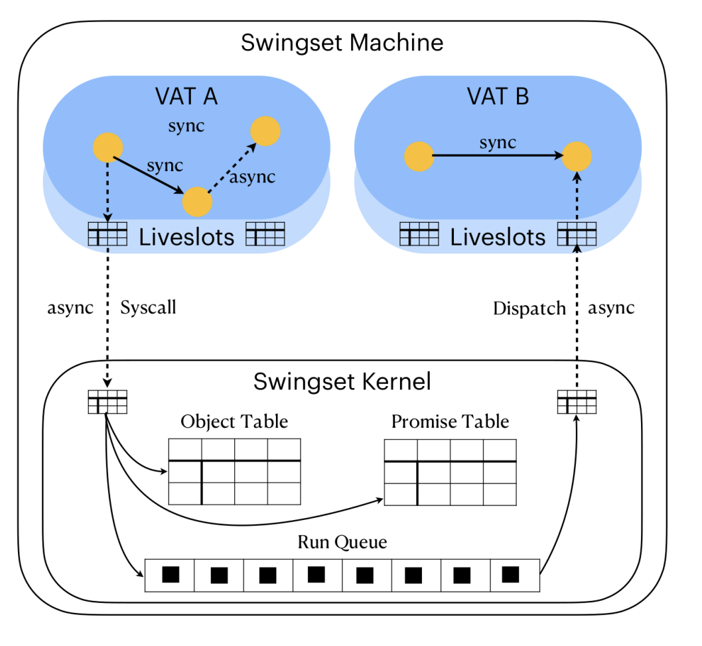
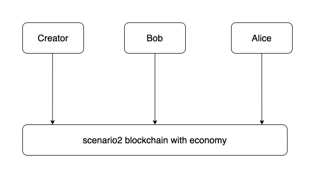
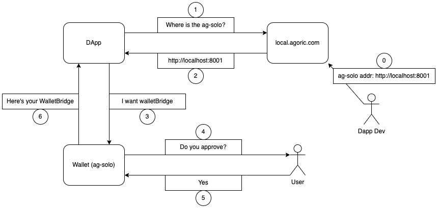
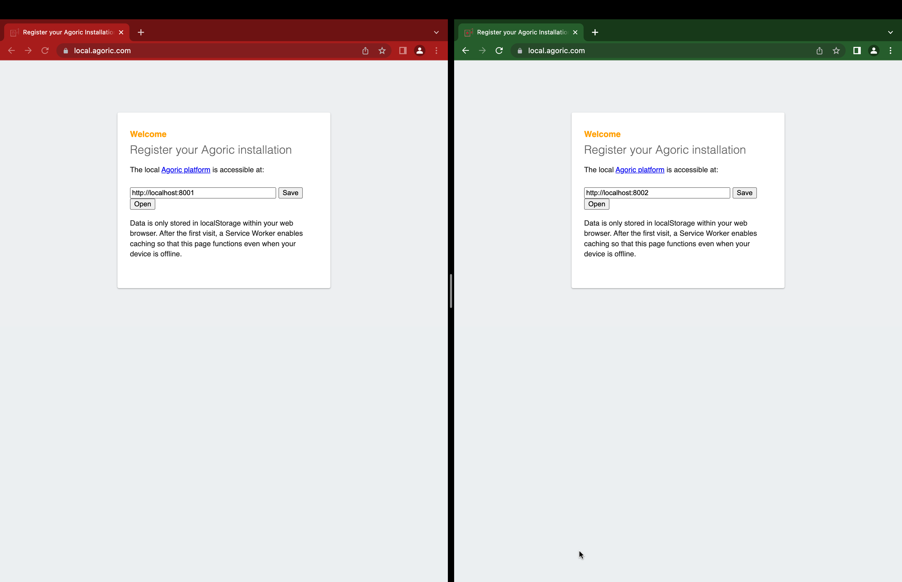
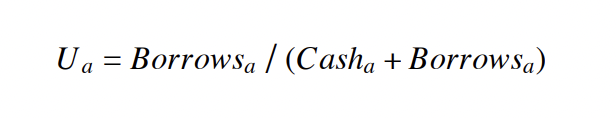
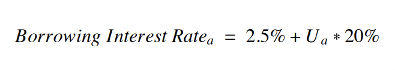
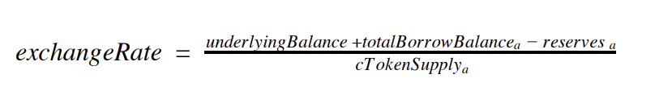
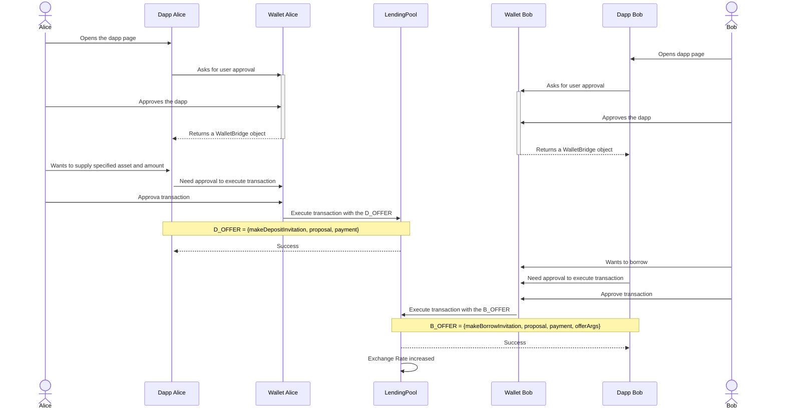

# Lecture Seven - Multiuser Dapps, Lending Protocol
## Table of Contents
* Multiuser Dapps
  * SwingSet and Cosmos Layer
    * SwingSet (AgoricVM)
  * `cosmic-swingset` Package
    * Prerequisites
    * Multiple `ag-solos` with `cosmic-swingset`
      * How to start an `ag-solo` with 1M ISTs?
  * Sample: How do we showcase LendingPool using 3 `ag-solos` and one node `local-chain`?
    * Make sure your dapp UI connects to the correct `ag-solo`
* Pool Based Lending Protocol
  * What is a Lending Pool?
  * How does a Lending Pool work?
  * Sample Use Case

# Multiuser Dapps
Decentralization enables us to do business with **people we don't trust.** Hence, most of the dapps designed to 
work in a multiuser manner where users interacting with each other. Like, trading assets, renting NFTs etc. This  
means that as a dapp developer, you might need to test your dapps using multiple `ag-solos`. 

Agoric offers a `sim-chain` feature for quick testing with a simulated chain and an `ag-solo` running together.
This is nice and useful but for a structure where multiple `ag-solos` need to work with a shared blockchain, `sim-chain`
falls short. We need a way to separate the blockchain and `ag-solo` locally. There's `cosmic-swingset` package for that.
But first, some context.

## Context: SwingSet and Cosmos Layer

Below is a diagram showing the `Agoric Tech Stack`


> _Figure 1: Agoric Tech Stack, image from [Agoric Docs](https://docs.agoric.com/guides/platform/)_

As you can see at the bottom layer there's the `Cosmos/Tendermint` which handles consensus across the Agoric network.
On top of that, there's `SwingSet`:

### What is `SwingSet`?
`SwingSet` is a kernel that handles communication between `vats`. It's also called `AgoricVM`. Each `vat` inside 
a `SwingSet` kernel is a hardened version of the XS JavaScript Engine. Below is a diagram that visualizes a 
`SwingSet`:



> _Figure 2: SwingSet Kernel_

Above screenshot is taken from [Agoric Swingset Kernel and Userspace, Phase 2](https://agoric.com/wp-content/uploads/2021/11/informal-agoric-report-phase2.pdf) 
security audit. Do not forget to check it out and other reports at [Agoric Security](https://agoric.com/security/).

## `cosmic-swingset` Package

[cosmic-swingset](https://github.com/Agoric/agoric-sdk/tree/65d3f14c8102993168d2568eed5e6acbcba0c48a/packages/cosmic-swingset)
has a lot of useful features for running an `Agoric VM` that runs on an actual cosmos node.

### Prerequisites
`Cosmos SDK` is built using `Go Programming Language`. Thus, in order to access its consensus features we need some
helpers to build the bridge between `SwingSet` and consensus layer. These helpers are;
* `agd`
* `ag-cosmos-helper`

We need to build these from source;

> You can check out [Agoric Docs - Starting Multiuser Dapps - Usage - Steps 3 and 4](https://docs.agoric.com/guides/dapps/starting-multiuser-dapps.html#usage), but I'll put the steps here anyway, for convenience.

```shell
cd agoric-sdk/packages/cosmic-swingset && make
```

Then;

```shell
# Display the directory that should be in your $PATH.
echo ${GOBIN-${GOPATH-$HOME/go}/bin}
# Attempt to run a binary that was installed there.
ag-cosmos-helper version --long
```

Important thing here is that `agd` and `ag-cosmos-helper` need to be in your `$PATH`.

For a successful `make` operation check out the prerequisites at
[cosmic-swingset/README.md](https://github.com/Agoric/agoric-sdk/tree/65d3f14c8102993168d2568eed5e6acbcba0c48a/packages/cosmic-swingset#build-from-source) 

### Multiple `ag-solos` with `cosmic-swingset`
`cosmic-swingset` package contains 4 scenarios in total for different configurations;
* scenario1
* scenario2
* scenario3
* scenario0

Only `scenario2` support configuration for multi `ag-solo` setup. So we'll focus on that here. See
[cosmic-swingset/README.md](https://github.com/Agoric/agoric-sdk/tree/65d3f14c8102993168d2568eed5e6acbcba0c48a/packages/cosmic-swingset)
and 
[cosmic-swingset/Makefile](https://github.com/Agoric/agoric-sdk/blob/65d3f14c8102993168d2568eed5e6acbcba0c48a/packages/cosmic-swingset/Makefile)
for information on other scenarios and implementation details. 


In order to start a multiuser dapp using `cosmic-swingset` package, you must first setup the environment;

```shell
cd agoric-sdk/packages/cosmic-swingset
make scenario2-setup BASE_PORT=8000 NUM_SOLOS=3
```

* `NUM_SOLOS`: Number of `ag-solos` you want to create, default is one.
* `BASE_PORT`: Indicates the port for the first `ag-solo`, increments by one for other `ag-solos`, if any. For the above
configuration, ports used are: 8000, 8001, 8002.

Once the setup is completed, we can go ahead and start the chain;

```shell
make scenario2-run-chain-economy
```

There are several options for chain configuration. In the Pool Based Lending Protocol, we use the configuration
`scenario2-run-chain-economy` because we need to interact with Agoric's economic services. If you don't need to
interact with any of those stuff, you can just simply use `scenario2-run-chain` which is faster to boot;

```shell
make scenario2-run-chain
```

Once you startup the chain(with any of the configurations above), now it is time to start the `ag-solos`;

```shell
cd agoric-sdk/packages/cosmic-swingset
make scenario2-run-client BASE_PORT=8000
```

There's another env variable has to be set when starting the second `ag-solos` and so on. That is 
`SOLO_OTEL_EXPORTER_PROMETHEUS_PORT` which specifies a port for [Prometheus](https://prometheus.io/)
to monitor the `ag-solos` metrics. Thus, for the second `ag-solo` the startup command would be;

```shell
cd agoric-sdk/packages/cosmic-swingset
make scenario2-run-client BASE_PORT=8001 SOLO_OTEL_EXPORTER_PROMETHEUS_PORT=9466 # 9465 is the default value
```

You can repeat the step above for as many `ag-solos` as you want by replacing the env variables with appropriate ones.

#### How to start an `ag-solo` with 1M ISTs?
Let's imagine you have a dapp that depends on some environmental components. For instance, `LendingPool` needs some
AMM Pool to exist in order to function properly. Thus, the `creator` needs to add that pool to AMM. This operation
needs a lot of IST and the `creator` might run out of IST if it is bootstrapped with default _coin config_. To 
prevent this from happening we use this cool trick:

```shell
cd agoric-sdk/packages/cosmic-swingset
make scenario2-run-client BASE_PORT=8000 SOLO_COINS='13000000ubld,1000000000000uist,1122000000ibc/usdc1234,3344000000ibc/atom1234'
```

Imagine the `creator` runs on the port 8000, the env variable `SOLO_COINS` contains the _coin config_ as a string.
There's a default value set in Makefile, but it is possible to override this value as shown in the above command.
Notice the number of `uist`, decimal places for IST is `6` so `1M * 10 ** 6` units of IST is bootstrapped to 
the corresponding `ag-solos` wallet. This is a useful trick that you can consider for your tests with `scenario2`.

## Sample: How do we showcase LendingPool using 3 `ag-solos` and one node `local-chain`?
In LendingPool, we use a network configuration where there are 3 `ag-solos` and one local blockchain. Those `ag-solos`
are;
* Creator
* Alice
* Bob

Recall that `creator` has to bootstrap some stuff necessary for the showcase scenario. Below is the simple diagram;



We talked about much of the commands we use to setup this environment above, so I'll just put them all together here;

Terminal One:

```shell
cd agoric-sdk/packages/cosmic-swingset
make scenario2-setup BASE_PORT=8000 NUM_SOLOS=3 && make scenario2-run-chain-economy
```

Terminal Two, Creator:

```shell
cd agoric-sdk/packages/cosmic-swingset
make scenario2-run-client BASE_PORT=8000 SOLO_COINS='13000000ubld,1000000000000uist,1122000000ibc/usdc1234,3344000000ibc/atom1234'
```

Terminal Three, Alice:

```shell
cd agoric-sdk/packages/cosmic-swingset
make scenario2-run-client BASE_PORT=8001 SOLO_OTEL_EXPORTER_PROMETHEUS_PORT=9466
```

Terminal Four, Bob:

```shell
cd agoric-sdk/packages/cosmic-swingset
make scenario2-run-client BASE_PORT=8002 SOLO_OTEL_EXPORTER_PROMETHEUS_PORT=9467
```

Terminal Five:

```shell
cd agoric-sdk/packages/cosmic-swingset/t1
agoric open --no-browser --repl
agoric open --no-browser --hostport=127.0.0.1:8001 --repl
agoric open --no-browser --hostport=127.0.0.1:8002 --repl
```

`t1` directory is where the user information like keys and addresses are stored. The flag `--hostport` indicates the
address of the `ag-solo` that this command is going to connect when executing. So the second `agoric open` opens the
wallet for Alice and the third one opens the wallet for Bob.

### Make sure your Dapp UI connects to the correct `ag-solo`
Let's assume you completed all the steps above, deployed LendingPool contracts and started the dapp UI. Recall that
the dapp UI needs a `walletBridge` object in order to interact with Agoric network. Since the `walletBridge` can only
be dispatched via a user approval, dapp UI needs to connect to the `ag-solo` it is going to represent. The way this is
handled is by opening a webSocket to the `ag-solo`. Remember the configuration we have running, 3 `ag-solos` right?
Alice and Bob will have their own dapp UI, so how are we going to make sure that those dapp UIs are connected to the
correct `ag-solo`? Agoric introduces a service for that hosted on `local.agoric.com`. Below diagram illustrates the
flow;



As we said dapp UI needs an address to open a WebSocket to, the way it acquires that is to ask `local.agoric.com`.
In the step number `0`, dapp dev enters the address of the `ag-solo` and `local.agoric.com` keeps that information
in browser storage like _cookies_. Thus, in order to have different dapp UIs connect to different `ag-solos`, we need
a separate storage space for the browser we are trying to connect to `ag-solo` from. Options for that might be;
* Using different browser like Firefox and Chrome for Alice and Bob
* If you're using Chrome, creating different profiles for Alice and Bob

Since LendingPool UI is most compatible with Chrome (for now), we choose the second option. It looks like this:



In the diagram above, red profile represents Alice whereas green one represents Bob. Dapp UI for Alice should be 
opened in the red profile while Bob's dapp UI should be opened in green one. 

# Pool Based Lending Protocol
## What is a Lending Pool?
Lending Pool is a DeFi concept that has so many live examples such as [Compound Finance](https://compound.finance/) 
and [AAVE](https://aave.com/). The basic idea is that there's a liquidity pool where LPs (Liquidity Providers) supply 
liquidity seeking various returns such as interest. Most of the time, these lending pools have their own governance
token they distribute to LPs as well. One of the main benefits is that lending pools do not perform the same `GateKeeping` 
as the banks are currently doing on who gets to access the liquidity and who does not. 

## How does a Lending Pool work?
The idea is great, but how's that going work? Our `Pool Based Lending Protocol` is inspired by [Compound Finance](https://compound.finance/)
which one of the biggest decentralized lending protocols, if not the biggest. So I'll use some of Compound's logic
in order to explain the protocol. We explain how Compound Finance works in our [blog post at BytePitch](https://bytepitch.com/blog/pool-based-lending-protocol-agoric/). 
Do not forget to check it out if you want to learn more.

One of the main features for a decentralized lending protocol is **Over-collateralization**. Here's an example of
over-collateralization from our blog post:

"_The word 'over' means that the value of collateral should be higher than the value of debt._ 
_For instance, if you have $100 to use as collateral and the collateralization factor is %80 then you_ 
_can borrow $80 at most. The main idea is to secure the lender in a way that even if the borrower doesn't_ 
_pay their debt, the lender does not lose money._"

There are three formulas `Pool Based Lending Protocol` is depending on. Check out [Compound Whitepaper](https://compound.finance/documents/Compound.Whitepaper.pdf)
to learn more.

1. **Utilization Ratio:** Ratio between total debt in the protocol and the total supply of the protocol.
  
   

2. **Borrow Rate:** The current interest rate of the borrow.

   

3. **Exchange Rate:** Every pool in the lending protocol gives out a pool specific wrapper token. For Compound these
are called `cTokens` and for our protocol they're called `AgToken`. `Exchange Rate` is the rate between the actual token
and the wrapper token. Below is the formula.
  
   

Here's an example from our blog post on how the interest rate is affected from the liquidity in the pool:

"_For example, let's say there's $1000 of some underlying asset in a pool and also $100 of total debt lent out there._
_At this point of the market let's also say the annual interest rate applied to loans is %x._ 
_If someone borrows $50 more now the current market state is changed to, $950 of underlying asset liquidity and $150_ 
_total debt out there. So, for the sake of dynamic interest rate new annual interest rate is now %y and we are sure_
_that y > x because the underlying liquidity is now less than what it was so the price of money, interest rate,_ 
_is now increased._"

## Sample Use Case
Below is a simple use case where we show how the supplier Alice makes money as the `exchange rate` increases:


