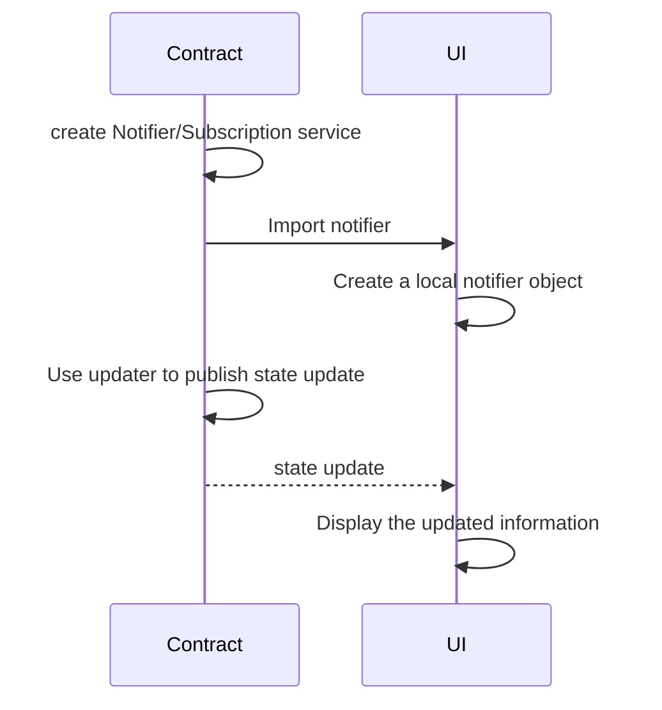

# Lecture Six - Assignment
## Assignment Description:

1. Import your project developed for assignment 5
2. Add publisher service using Notifiers or Subscriptions (define relevant method and object state to be published);
3. Create a simple UI to present the data extracted through the notifier/subscription service.

## Sequence diagram

