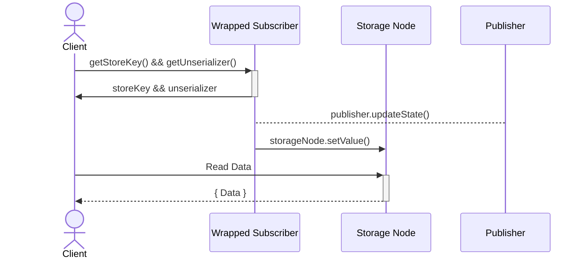

# Lecture Six - Notifiers and Subscriptions

## Table of Content

- Notifier package
- Different conveyor of values types
- Different tools to consume an asynchronous iteration
  - For-await-of loop
  - ObserveIteration adaptor
  - ObserveIterator adaptor
- Testing Examples
  - Success example
  - Promise example
  - Local representative example
  - Generic representative example
  - SubscriptionIterator example
- makeSubscriptionKit vs makePublishKit
- makeNotifierKit vs makeSubscriptionKit
- User Interface (UI)
- Storing Subscriber Data
  - Enter vat-chainStorage

## Notifier package

The [notifier package](https://github.com/Agoric/agoric-sdk/tree/65d3f14c8102993168d2568eed5e6acbcba0c48a/packages/notifier) "let a service notify clients of state changes. Specifically, both are abstractions for producing and consuming asynchronous value sequences. They rely on promises to deliver a stream of messages allowing many clients to receive notifications without the originator having to track a subscription list. An object wanting to publish updates to interested clients makes a notifier or a subscription available to them." - [Notifiers and Subscriptions](https://docs.agoric.com/guides/js-programming/notifiers.html)

## Different conveyor of values types

- A **lossless conveyor** of values refers to a mechanism that ensures that all values in an asynchronous iteration are accurately and completely conveyed, without any data loss or corruption.
  The term "lossless" indicates that no information is lost during the conveyance process, and the values are conveyed in their entirety.
  This means that all published state, the non-final values as well as the final value, will be available at any time.

- A **lossy conveyor** of values refers to a mechanism for conveying values in an asynchronous iteration where some values may not be accurately conveyed.
  The term "lossy" indicates that some information may be lost or discarded during the conveyance process. However, the termination or final value of the iteration is still conveyed without loss, ensuring that the receiver is aware that the iteration has been completed.
  This means that you may miss any published state if a more recent published state can be reported instead.

- A **prefix-lossy conveyor** of values requires eager consumption of the publisher so it can be completely lossless.
  The term "prefix-lossy" refers to the fact that values published before the consumer requests an iterator may be lost, but once an iterator is obtained, the values enumerated by that iterator will be complete and accurate.
  This means that you may miss everything published before you ask the returned iterable for an iterator. But the returned iterator will enumerate each thing published from that iterator's starting point.

The [SubscriptionKit](https://github.com/Agoric/agoric-sdk/blob/65d3f14c8102993168d2568eed5e6acbcba0c48a/packages/notifier/src/subscriber.js) is lossless conveyor of values; <br>
The [NotifierKit](https://github.com/Agoric/agoric-sdk/blob/65d3f14c8102993168d2568eed5e6acbcba0c48a/packages/notifier/src/notifier.js) is a lossy conveyor of values; <br>
The [PublishKit](https://github.com/Agoric/agoric-sdk/blob/65d3f14c8102993168d2568eed5e6acbcba0c48a/packages/notifier/src/publish-kit.js) is a prefix-lossy conveyor of values; <br>

## Different tools to consume an asynchronous iteration

The [notifier package documentation](https://github.com/Agoric/agoric-sdk/blob/65d3f14c8102993168d2568eed5e6acbcba0c48a/packages/notifier/README.md) advises using these two different approaches to consume an asynchronous iteration:

- the JavaScript `for-await-of` syntax
- the `observeIteration` adaptor
- the `observeIterator` adaptor

To better understand the difference between them, we are going to analyze their [source code](https://github.com/Agoric/agoric-sdk/blob/65d3f14c8102993168d2568eed5e6acbcba0c48a/packages/notifier/test/iterable-testing-tools.js).
But first, we will require an asynchronous iteration, our `publisher`:

```js
/**
 * See the Paula example in the README
 *
 * @param {IterationObserver<Passable>} iterationObserver
 * @returns {void}
 */
export const paula = (iterationObserver) => {
  // Paula the publisher says
  iterationObserver.updateState("a");
  iterationObserver.updateState("b");
  iterationObserver.finish("done");
};
```

The `iterationObserver` object is created using the `makeNotifierKit()` or the `makeSubscriptionKit()`, which will return an `updater` or `publication`, respectively

```js
type IterationObserver<T> = {
  updateState: (nonFinalValue: T) => void,
  finish: (completion: T) => void,
  fail: (reason: any) => void,
};
```

### For-await-of loop

Consume the iteration using the `for-await-of` loop:

- can see the non-final values and whether the iteration completes or fails.
- can see a failure reason,
- cannot see the completion value

```js
/**
 * See the Alice example  in the README
 *
 * @param {AsyncIterable<Passable>} asyncIterable
 * @returns {Promise<Passable[]>}
 */
export const alice = async (asyncIterable) => {
  const log = [];

  try {
    for await (const val of asyncIterable) {
      log.push(["non-final", val]);
    }
    log.push(["finished"]);
  } catch (reason) {
    log.push(["failed", reason]);
  }
  return log;
};
```

Notice that the finish value is not pushed to the log array, only the status `finished`.
If we print the log returned on the function above, assuming we are iterating through Paula's publisher, the result would be:

```js
// eventually prints
// non-final a
// non-final b
// the iteration finished
```

### ObserveIteration adaptor

Consume the iteration using the `observeIteration(asyncIterableP, iterationObserver)` adaptor:

- can see the non-final values and whether the iteration completes or fails.
- can see a failure reason,
- can see the completion value

```js
/**
 * See the Bob example in the README
 *
 * @param {ERef<AsyncIterable<Passable>>} asyncIterableP
 * @returns {Promise<Passable[]>}
 */
export const bob = async (asyncIterableP) => {
  const log = [];
  const observer = harden({
    updateState: (val) => log.push(["non-final", val]),
    finish: (completion) => log.push(["finished", completion]),
    fail: (reason) => log.push(["failed", reason]),
  });
  await observeIteration(asyncIterableP, observer);
  return log;
};
```

When using this method we can see that the finish value (`completion`) is pushed to the log array.
If we print the log returned on the function above, assuming we are iterating through Paula's publisher, the result would be:

```js
// eventually prints
// non-final a
// non-final b
// finished done
```

### ObserveIterator adaptor

The difference between using `observeIteration` and `observeIterator` to consume an asynchronous iteration refers to the level of abstraction used to interact with the iteration. It is important to remember that the observeIterator, `carol()`, only applies to `subscriptions`.

The observeIteration takes an `AsyncIterable` as an argument, which is a higher level abstraction that provides a more convenient interface for consuming an iteration. This approach is often easier to use and more convenient but may not provide as much control over the underlying iteration process.

On the other hand, observeIterator takes an `AsyncIterator` as an argument, which is a lower-level abstraction that provides direct access to the underlying iterator. This approach provides more control over the iteration process, but may require more complex code to handle the iteration and may be less convenient to use.

Carol's approach using observeIterator directly is often used in situations where more control over the iteration process is needed, such as when implementing custom asynchronous data structures or when dealing with complex or highly optimized iteration processes.

```js
/**
 * See the Carol example in the README. The Alice and Bob code above have
 * been abstracted from the code in the README to apply to any IterationObserver
 * and AsyncIterable. By contrast, the Carol code is inherently specific to
 * subscriptions.
 *
 * @param {ERef<Subscription<Passable>>} subscriptionP
 * @returns {Promise<Passable[]>}
 */
export const carol = async (subscriptionP) => {
  const subscriptionIteratorP = E(subscriptionP)[Symbol.asyncIterator]();
  const { promise: afterA, resolve: afterAResolve } = makePromiseKit();

  const makeObserver = (log) =>
    harden({
      updateState: (val) => {
        if (val === "a") {
          // @ts-expect-error
          afterAResolve(E(subscriptionIteratorP).subscribe());
        }
        log.push(["non-final", val]);
      },
      finish: (completion) => log.push(["finished", completion]),
      fail: (reason) => log.push(["failed", reason]),
    });

  const log1 = [];
  const observer1 = makeObserver(log1);
  const log2 = [];
  const observer2 = makeObserver(log2);

  const p1 = observeIterator(subscriptionIteratorP, observer1);
  // afterA is an ERef<Subscription> so we use observeIteration on it.
  const p2 = observeIteration(afterA, observer2);
  await Promise.all([p1, p2]);
  return [log1, log2];
};
```

If we print the log returned on the function above, assuming we are iterating through Paula's publisher, the result would be:

```js
[log1:
// eventually prints
// non-final a
// non-final b
// finished done
,
log2:
// eventually prints
// non-final b
// finished done
];
```

## Testing Examples

The following examples showcase the effectiveness and functionality of the code studied earlier, as they import and utilize those specific methods.

```js
import { paula, alice, bob, carol } from "./iterable-testing-tools.js";
```

These [tests](https://github.com/Agoric/agoric-sdk/blob/65d3f14c8102993168d2568eed5e6acbcba0c48a/packages/notifier/test/test-subscriber-examples.js) will be done using the `makeSubscriptionKit()`, although the same logic applies when using the `makeNotifierKit()`, as it is explained on sub-chapter [makenotifierkit-vs-makesubscriptionkit](#makenotifierkit-vs-makesubscriptionkit)

### Success example

The first test demonstrates the behavior of using both ways of consuming an interation, the `for-await-of` syntax implemented in `alice()`, and the `observeIteration` adaptor implemented in `bob()`:

```js
test("subscription for-await-of success example", async (t) => {
  const { publication, subscription } = makeSubscriptionKit();
  paula(publication);
  const log = await alice(subscription);

  t.deepEqual(log, [["non-final", "a"], ["non-final", "b"], ["finished"]]);
});

test("subscription observeIteration success example", async (t) => {
  const { publication, subscription } = makeSubscriptionKit();
  paula(publication);
  const log = await bob(subscription);

  t.deepEqual(log, [
    ["non-final", "a"],
    ["non-final", "b"],
    ["finished", "done"],
  ]);
});
```

As described previously, when using the for-await-of approach, the value of the `finished` status is not returned, unlike the observeIteration that returns the value `done`.

### Promise example

At this test, instead of passing the `subscription`, which is an `AsyncIterable` object, to alice and bob, we are passing a `promise`.
Notice that alice receives as a parameter ` @param {AsyncIterable<Passable>} asyncIterable` while bob receives a `@param {ERef<AsyncIterable<Passable>>} asyncIterableP`.
This means that alice's code will fail when trying to iterate through the Promise, while bob will succeed.

```js
test("subscription for-await-of cannot eat promise", async (t) => {
  const { publication, subscription } = makeSubscriptionKit();
  paula(publication);
  const subP = Promise.resolve(subscription);
  // Type cast because this test demonstrates the failure that results from
  // giving Alice a promise for a subscription.
  const log = await alice(/** @type {any} */ (subP));

  // This TypeError is thrown by JavaScript when a for-await-in loop
  // attempts to iterate a promise that is not an async iterable.
  t.is(log[0][0], "failed");
  t.assert(log[0][1] instanceof TypeError);
});

test("subscription observeIteration can eat promise", async (t) => {
  const { publication, subscription } = makeSubscriptionKit();
  paula(publication);
  const subP = Promise.resolve(subscription);
  const log = await bob(subP);

  t.deepEqual(log, [
    ["non-final", "a"],
    ["non-final", "b"],
    ["finished", "done"],
  ]);
});
```

### Local representative example

For this test, we need to understand the purpose of:

```js
const localSub = makeSubscription(E(subP).getSharableSubscriptionInternals());
```

This method is used to distribute a Notifier/Subscription efficiently over the network, by obtaining this from the Subscription to be replicated and applying `makeSubscription` to it at the new site to get an equivalent local Notifier at that site.

```js
test("subscription for-await-of on local representative", async (t) => {
  const { publication, subscription } = makeSubscriptionKit();
  paula(publication);
  const subP = Promise.resolve(subscription);
  const localSub = makeSubscription(E(subP).getSharableSubscriptionInternals());
  const log = await alice(localSub);

  t.deepEqual(log, [["non-final", "a"], ["non-final", "b"], ["finished"]]);
});

test("subscription observeIteration on local representative", async (t) => {
  const { publication, subscription } = makeSubscriptionKit();
  paula(publication);
  const subP = Promise.resolve(subscription);
  const localSub = makeSubscription(E(subP).getSharableSubscriptionInternals());
  const log = await bob(localSub);

  t.deepEqual(log, [
    ["non-final", "a"],
    ["non-final", "b"],
    ["finished", "done"],
  ]);
});
```

The results returned by alice and bob will have the same behavior as the first test since it receives as an argument an AsyncIterable object corresponding to the subscription instead of the promise `subP`. Solving the error returned by alice() on the previous test.

Another way to convert a promise object of a notifier into an AsyncIterable is by using the method [makeAsyncIterableFromNotifier()](https://github.com/Agoric/agoric-sdk/blob/65d3f14c8102993168d2568eed5e6acbcba0c48a/packages/notifier/src/asyncIterableAdaptor.js#L37).

### Generic representative example

For this test, we need to understand the purpose of the `observeIteration()`.
As we can see from the tests below, this function receives as a parameter a promise object of the subscription and an iterationObserver which will be the updater of the newly created notifierKit().
The objective of observeIteration() is to filter by the different methods called on the subscription Promise.

```js
/**
 * This reads from `asyncIterableP` updating `iterationObserver` with each
 * successive value. The `iterationObserver` may only be interested in certain
 * occurrences (`updateState`, `finish`, `fail`), so for convenience,
 * `observeIteration` feature tests for those methods before calling them.
 *
 * @template T
 * @param {ERef<AsyncIterable<T>>} asyncIterableP
 * @param {Partial<IterationObserver<T>>} iterationObserver
 * @returns {Promise<undefined>}
 */
export const observeIteration = (asyncIterableP, iterationObserver) => {
  const iteratorP = E(asyncIterableP)[Symbol.asyncIterator]();
  return observeIterator(iteratorP, iterationObserver);
};
```

```js
test("subscription for-await-of on generic representative", async (t) => {
  const { publication, subscription } = makeSubscriptionKit();
  paula(publication);
  const subP = Promise.resolve(subscription);
  const { publication: p, subscription: localSub } = makeSubscriptionKit();
  await observeIteration(subP, p);
  const log = await alice(localSub);

  t.deepEqual(log, [["non-final", "a"], ["non-final", "b"], ["finished"]]);
});

test("subscription observeIteration on generic representative", async (t) => {
  const { publication, subscription } = makeSubscriptionKit();
  paula(publication);
  const subP = Promise.resolve(subscription);
  const { publication: p, subscription: localSub } = makeSubscriptionKit();
  await observeIteration(subP, p);
  const log = await bob(localSub);

  t.deepEqual(log, [
    ["non-final", "a"],
    ["non-final", "b"],
    ["finished", "done"],
  ]);
});
```

The results returned by alice and bob will have the same behavior as the first test since it receives as an argument an AsyncIterable object corresponding to the subscription.

### SubscriptionIterator example

This test implements the observeIterator method described on sub-chapter [ObserveIterator adaptor](#observeiterator-adaptor).
Passing as argument the AsyncIterable subscription object.

```js
// /////////////////////////////////////////////////////////////////////////////
// Carol is specific to subscription, so there is nothing analogous to the
// following in test-notifier-examples

test("subscribe to subscriptionIterator success example", async (t) => {
  const { publication, subscription } = makeSubscriptionKit();
  paula(publication);
  const log = await carol(subscription);

  t.deepEqual(log, [
    [
      ["non-final", "a"],
      ["non-final", "b"],
      ["finished", "done"],
    ],
    [
      ["non-final", "b"],
      ["finished", "done"],
    ],
  ]);
});
```

## makeSubscriptionKit vs makePublishKit

While exploring the `agoric-sdk`, we can notice something called `publishKit` but it isn't used in any smart contract that we could find. This seems like a minor detail but still, it might get confusing. So we'll talk about that briefly.

Let's take a look at `makeSubscriptionKit`'s implementation:

```js
const makeSubscriptionKit = () => {
  const { publisher, subscriber } = makePublishKit();

  // The publish kit subscriber is prefix-lossy, so making *this* subscriber completely
  // lossless requires eager consumption of the former.
  // Such losslessness inhibits GC, which is why we're moving away from it.
  const pubList = subscriber.subscribeAfter();
  const subscription = makeSubscription(pubList);

  /** @type {IterationObserver<T>} */
  const publication = Far("publication", {
    updateState: publisher.publish,
    finish: publisher.finish,
    fail: publisher.fail,
  });

  return harden({ publication, subscription });
};
```

As you can see, on the first line of the method body, there's `makePublishKit` creating `publisher` and the `base subscriber`. We use the term `base subscriber` because in the lines below, that subscriber we fetched from publishKit is wrapped around some methods that enable it to be consumed by iterating over its values and also complements the `prefix lossy` nature of the publishKit.

```js
const pubList = subscriber.subscribeAfter();
const subscription = makeSubscription(pubList);
```

## makeNotifierKit vs makeSubscriptionKit

The `makeNotifierKit` tests will show the same behavior as the `makeSubscriptionKit`, except for the returning values. As explained before, when using the makeNotifierKit, its lossy nature will make it return only the last updated value.

Using as an example the first test of the makeSubscriptionKit, here it is the correspondent one using makeNotifierKit.

```js
test("notifier for-await-of success example", async (t) => {
  const { updater, notifier } = makeNotifierKit();
  paula(updater);
  const log = await alice(notifier);

  t.deepEqual(last(log), ["finished"]);
});

test("notifier observeIteration success example", async (t) => {
  const { updater, notifier } = makeNotifierKit();
  paula(updater);
  const log = await bob(notifier);

  t.deepEqual(last(log), ["finished", "done"]);
});
```

As we can see, the returned log is missing the non-final values `['non-final', 'a'] ['non-final', 'b']`.

## User Interface (UI)

The notifier package is extremely useful to extract data from the blockchain to be presented in the `user interface`.
Let's analyze the code below, from the [dapp-card-store UI](https://github.com/Agoric/dapp-card-store/blob/main/ui/src/App.js).

```js
import { makeAsyncIterableFromNotifier as iterateNotifier } from '@agoric/notifier';

function App() {

  ...
      ...

      publicFacetRef.current = publicFacet;

      const availableItemsNotifier = E(
        publicFacetRef.current,
      ).getAvailableItemsNotifier();

      for await (const cardsAvailableAmount of iterateNotifier(
        availableItemsNotifier,
      )) {
        setAvailableCards(cardsAvailableAmount.value);
      }
    };

  ...
}
export default App;

```

The method `makeAsyncIterableFromNotifier()` creates a local notifier object, as described in the sub-chapter [Local representative example](#local-representative-example). In this example, the developer fetched the `availableItemsNotifier` from the contract public facet, using the makeAsyncIterableFromNotifier to create the local notifier `cardsAvailableAmount`, and passed it as an argument to setAvailableCards to display the information on the graphical interface.

`Note: no UI examples using getSharableSubscriptionInternals() were found on the agoric organization repo`

## Storing Subscriber Data

Is it free-read data from Agoric? Unfortunately, as presently constructed, the answer to this question is no.
In Agoric, the main way for receiving updates from blockchain is to use `Notifiers` and `Subscribers`.

For a notifier,

```js
E(notifier).getUpdateSince();
```

For a subscriber,

```js
subscriberIterator = subscriber[Symbol.asyncIterator]();
E(subscriberIterator).next();
```

Since both of these operations invoke methods on objects that are living on the blockchain, they cost gas fee. Agoric team realizes that to host large-scale applications in the ecosystem, they need to come up with a solution to this problem.

### Enter vat-chainStorage

As a solution to this, the Agoric team designed a separate `static vat` that will serve as a key-value store.
The write access is limited to only other system-level components that have appropriate powers such as `inter-protocol`.
On the other hand read access is public. Anybody who knows the key to a `storageNode` can read the data for free.
It's an ongoing effort to make such a `vat` available to all third-party dapp developers.

> Recall a `static-vat` is a type of vat that is started during the bootstrap and hosts a system component.

Below is a diagram that illustrates how a normal `{ publisher, subscriber }` pair can be used to write to make us of
`vat-chainStorage`.



There are mechanisms implemented for wrapping subscribers.
You can check them out in [storesub.js](https://github.com/Agoric/agoric-sdk/blob/65d3f14c8102993168d2568eed5e6acbcba0c48a/packages/notifier/src/storesub.js)
