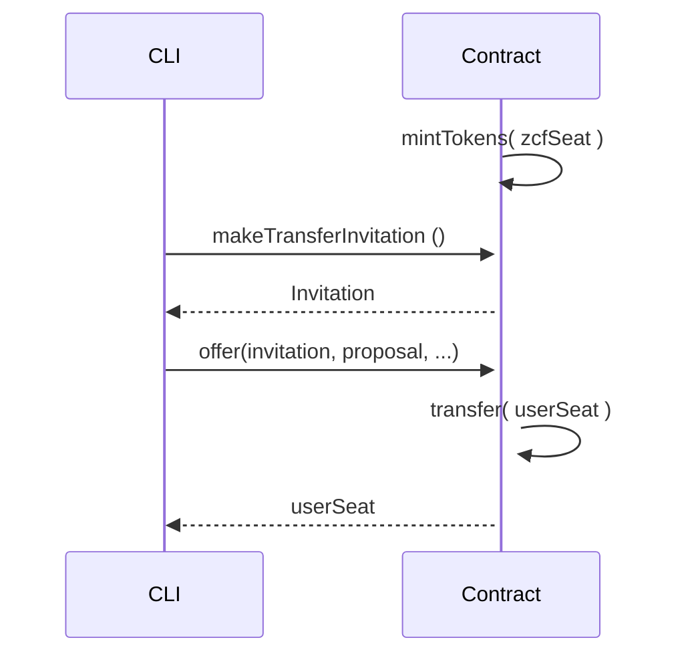

# Lecture Three - Assignment

## Assignment Description:

1. Create a new contract;
2. Mint some tokens on startup into a zcfSeat;
3. Create a function that allows a transfer of some of the minted tokens to a userSeat;
4. Create a new test file for the contract above;

## Sequence diagram

