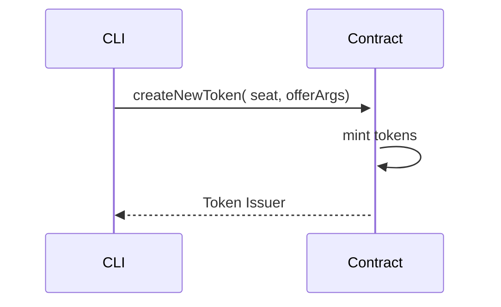

# Lecture Two - Assignment

## Assignment Description:

1. Do `agoric init assignment-two`. Go to the project directory, install dependencies.
2. Add `createNewToken` function to the contract.js file;
2. Add `createNewToken` to the creatorFacet;
3. Add the following tests to test-contract.js:
    - create new token;
    - compare both tokens issuers;
    - compare amounts of both tokens;

## Sequence diagram

