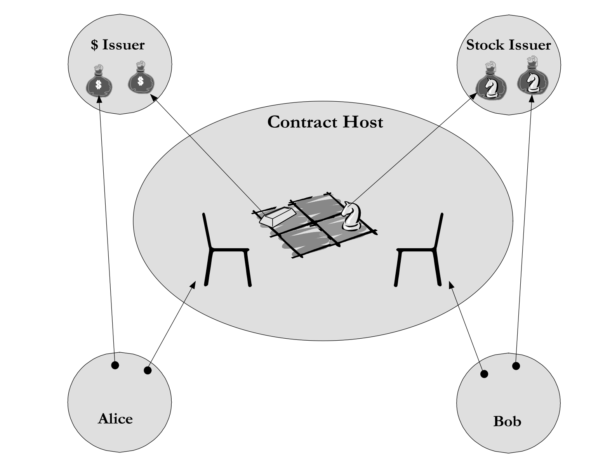

# Lecture Two - Introduction to ERTP and Zoe
## Table of Content
* ### ERTP
  * What is an electronic right?
  * Electronic right vs eright
  * What is ERTP?
  * Implementing sample `eright`s
  * ERTP in Agoric

* ### Zoe
  * Context
  * Structure Of A Zoe Contract
  * Offers
  * Two Sides Of Zoe
  * Contract Development Experience

## ERTP

### What is an electronic right?
* #### Object Capabilities
  In order to understand what an `electronic right` is we first need to take a look at the concept called `Object Capabilities`.

  

  The diagram above demonstrates the social relationships between people and was designed by The sociologist Mark Granovetter. The Object Capabilities 
discipline refers to this diagram as `Granovetter Operator` and uses it to illustrate the relationships between objects.

  In its essence, an `ocaps` (Object Capabilities) system authorizes users according to the object references they have. In an `ocaps` system, there's no 
Access Control Lists(ACLs). Simply your capabilities are defined by the object references you hold. 

* #### A Word On 'Rights'

  "Rights help people coordinate plans and resolve conflicts over the use of resources.
Rights partition the space of actions to avoid interference between separately formulated
plans, thus enabling cooperative relationships despite mutual suspicion and competing
goals [15]. This rights-based perspective can shed light on the problem of securing distributed computational systems"[2]

* #### From Objects To Electronic Rights
  The object references represent a right to perform a set of operations on a specific, designated resource.
In this context, we can use electronic rights to address the real-world problems which are currently being 
resolved by the rights we know as `normal`. Using contracts, law, courts, etc.

### Electornical right vs eright
Let's imagine Alice, Bob, and Carol from the `Granovetter Operator` are some objects living in a `ocap` environment.
- Alice has the `right` to invoke a resource from Carol.
- Alice knows Bob so she can pass her right to invoke Carol to Bob. Bob has no way of invoking Carol if Alice refuses to
pass this right to him.
- Carol has no authority to invoke any resource neither from Alice or Bob.

The type of `right` we're inspecting above has these features;
* Shareable
* Exercisable
* Opaque
* Specific

Here's what Mark Miller has to say about the differences between electronic rights and erights in [erights.org](http://erights.org/smart-contracts/index.html#ERTP);

"_Capabilities are electronic rights of a sort, but by themselves lack 2 crucial features needed for tradable electronic rights:_

* _Exclusive rights transfer._
* _Assayability (so a 3rd party can determine if a trade is mutually acceptable)._

_The next layer above distributed capabilities, ERTP, does provide these properties. 
The ERTP protocol accommodates fungible & non-fungible rights, exclusive & non-exclusive rights, 
and blinded or non-blinded transfer. **Only electronic rights manipulable via ERTP are called erights.**_"

So If we compare the rights we inspected above to the definition of `eright` from Mark Miller, we can see that the right
transfer from `Granovetter Operator` lacks the two main features for an electronic right to be called `eright`. Why?

1. An object reference is shareable but an eright has to be exclusive. What do we mean? <br>
   If Alice drops the capability after passing it to Bob, Bob
   happens to have exclusive access to Carol, but this isn’t an __*exclusive*__ right since Bob
   is unable to know that he is the only one who has it.[1]
2. A capability is opaque, but an eright has to be assayable. Meaning; <br>
   Assayability is needed for trade, since you must be able to determine what you would
   be getting before deciding to purchase. However, exclusive rights can only be reliably
   assayed by actually obtaining exclusive access to them, since otherwise, after you’ve
   assayed them, someone else may gain the exclusive, cutting you out. Trade of
   exclusives may therefore require a trusted third party who can hold them in escrow.[1]

If we're going to trade electronic rights in a distributed environment securely, the common features for all those rights are;
* Exclusive
* Assayable

But there are other features for an `eright` can possess;
* Fungible vs Non-fungible: We can implement both `Money` and something like a `Ticket` as `erights` where money is fungible and a ticket is non-fungible.
* Exercisable vs Symbolic: Money is symbolic, you cannot do anything with it other than trading it for something else. But something like a `Covered Call Option` is 
exercisable where you can exercise your right to `Buy` the covered asset before a deadline. Both `Money` and `Covered Call Option` can be implemented as `eright`s.

### What is ERTP?
ERTP is the protocol that transforms an electronic right into an `eright` by making it `Exclusive` and `Assayable`.

Here are some sample `eright` implementations via ERTP;
* #### Money
  [Sample Money Implementation](http://erights.org/elib/capability/ode/ode-capabilities.html#simple-money)
* #### Covered Call Option
  [Sample Covered Call Implementation](http://erights.org/elib/capability/ode/ode-bearer.html#options-contract)

### ERTP In Agoric
> **Note**: This section uses materials(code samples, diagrams, etc.) from [Agoric Docs ERTP](https://docs.agoric.com/guides/ertp/#ertp-concepts-overview).
> Visit the site for more in-depth learning materials. 

Agoric uses ERTP to trade `eright`s like money, NFTs etc. The version of ERTP Agoric uses has the following structure;


At the center of the above structure, there are three basic components: `Issuer`, `Mint` and `Brand`. 
Here's the relationship between these three components;


As you can see there's a `one-to-one` relationship between every `Issuer`, `Mint` and `Brand`. 

* **Issuer**: The source of truth for the digital asset. Issuer is the authority everyone trusts when trading
this currency. Below is a diagram showing how the issuer manages to be the source of truth.
  
* **Brand**: A unique object that is used to identify the digital asset we're working with. Brand information
can be shared publicly.
* **Mint**: The only way to print money of the `Brand` associated with this mint object.

This `one-to-one` relationship between `Issuer`, `Mint` and `Brand` is very important to keep the system secure.
Hence, they're immutable.

There are some other components that we must mention if we're going to talk about ERTP. They are,
* **Amount**: A representation of the actual asset. Amounts are not money. They're just an abstraction to make working with digital assets secure and easier.
* **Payment**: The form that an actual digital asset takes during a transfer. 
* **Purse**: The form of digital asset in a non-transfer state.

Let's take a look at how we can make use of the ERTP protocol to create fungible and non-fungible tokens;
* ##### How to create fungible tokens with ERTP?
  Initially;
  ```js
  const {
     issuer: quatloosIssuer,
     mint: quatloosMint,
     brand: quatloosBrand,
  } = makeIssuerKit('quatloos');  
  ```
  We call `makeIssuerKit` in order to get a fresh set of `Issuer`, `Mint` and `Brand` objects. Then we've to creat
the amount to be minted;
  ```js
  const quatloosSeven = AmountMath.make(quatloosBrand, 7n);  
  ```
  Once we have the amount, we can actually print the money using the `Mint` object,
  ```js
  const quatloosPayment = quatloosMint.mintPayment(quatloosSeven);
  ```
  A successful mint results in a `Payment` object. Payments are the money `on-the-go`, we should put it in a `Purse`
if we want to park our money. To put a payment inside a purse;
  ```js
  const quatloosPurse = quatloosIssuer.makeEmptyPurse();
  quatloosPurse.deposit(quatloosPayment);
  ```

* ##### How to create non-fungible tokens with ERTP?
  Our first step is very similar to the one we created a fungible asset but with only one difference;
  ```js
  const {
    mint: popMint,
    brand: popBrand,
    issuer: popIssuer,
   } = makeIssuerKit('POP', AssetKind.COPY_SET);
  ```
  The argument `AssetKind.COPY_SET` is specified when we want to create non-fungible tokens. The argument for fungible
tokens are `AssetKind.NAT` but we did not specify that because it's the default option. See the docs page for 
[other possible AssetKind options](https://docs.agoric.com/reference/ertp-api/ertp-data-types.html#assetkind). Once we have out issuerKit 
we can move on to the next step which is creating the amount to be minted;
  ```js
  const popAmount = AmountMath.make(popBrand, harden([{
        organization: 'Chainboard Academy',
        courseName: 'Agoric Bootcamp',
        studentId: '12',
      }]));
  ```
  The data of an NFT is wrapped around an array. This is particularly useful when we want to add/subtract non-fungible
amounts. Now we can move on to the minting phase;
  ```js
  const popPayment = popMint.mintPayment(popAmount);  
  ```
  We can store NFTs just like we store fungible tokens;
  ```js
  const popPurse = popIssuer.makeEmptyPurse();
  popPurse.deposit(popPayment);
  ```

## Zoe
### Context
"*...Contracts enable the exchange of rights across these protected domains.*"[2]

 

*Figure 4: Sample Exchange Diagram[3]*

Once we obtain `tradeable electronic rights`, we need a secure layer to enable trading of those rights.
That is exactly what a contract does as the quote above states. But this raises another problem. How are we going to
secure the contract from malicious users? In the diagram above Alice and Bob agree on[2];
* The issuers of each of the rights at stake.
* The source code of the contract.
* Who is to play which side of the contract.
* A third party they mutually trust to run their agreed code, *whatever* it is, honestly

This third party Alice and Bob mutually trust to run their code is **Contract Host**. `Zoe` is designed by Agoric
to serve as the contract host in Agoric ecosystem. It is the layer where all the smart contracts are installed
and run.

`Zoe` plays a key role in establishing trust between users and developers. How? In some other big networks like 
Ethereum, a smart contract developer has the full access to users assets inside the contract code. This enables 
some malicious developers to perform some bad actions. But in an `ocaps` system this should never happen. The
motto in a `ocaps` system is: *Do not bring security, remove insecurity.* `Zoe` brings this mindset to smart contract
development. The way `Zoe` does that is through `escrowing`. A smart contract is where mutually suspicious parties
trade rights. `Zoe` locks/escrows the rights of all parties until one of the conditions is met in the contract. A
developer has no direct access to rights but instead they implement the required logic by using `Amount`s. Remember `Amount`s 
from ERTP section? This is how `ERTP` and `Zoe` works together to establish secure trading of `erights`.

### Structure Of A Zoe Contract
`Zoe` acts as the *Contract Host* to secure users from malicious developers but it is also a rich framework for smart contract
developers to show their skills and creativity.

In Agoric smart contracts are deployed and accessed through `Zoe`. But, does `Zoe` accept every code installed as a smart contract?
Of course not, the smart contracts must have the following structure;

<details>
  <summary> 
    Sample Contract
  </summary>

```js
// @ts-check
// Checks the types as defined in JSDoc comments

// Add imports here

// Optional: you may wish to use the Zoe helpers in
// @agoric/zoe/src/contractSupport/index.js
import { swap as _ } from '@agoric/zoe/src/contractSupport/index.js';

// Import the Zoe types
import '@agoric/zoe/exported.js';

/**
* [Contract Description Here]
*
* @type {ContractStartFn}
  */
const start = (zcf, _privateArgs) => {
// ZCF: the Zoe Contract Facet

// privateArgs: any arguments to be made available to the contract
// code by the contract owner that should not be in the public
// terms.

// Add contract logic here, including the
// handling of offers and the making of invitations.

// Example: This is an example of an offerHandler
// which just gives a refund payout automatically.
const myOfferHandler = zcfSeat => {
zcfSeat.exit();
const offerResult = 'success';
return offerResult;
};

// Example: This is an invitation that, if used to make
// an offer will trigger `myOfferHandler`, giving a
// refund automatically.
const invitation = zcf.makeInvitation(myOfferHandler, 'myInvitation');

// Optional: Methods added to this object are available
// to the creator of the instance.
const creatorFacet = {};

// Optional: Methods added to this object are available
// to anyone who knows about the contract instance.
// Price queries and other information requests can go here.
const publicFacet = {};

return harden({
   creatorInvitation: invitation, // optional
   creatorFacet, // optional
   publicFacet, // optional
  });
};

harden(start);
export { start };
```
</details>

Above is a sample `Zoe` contract in it's the simplest form. However, it still contains all structural parts of a `Zoe` 
contract. Let's breakdown these components one bye one;
1. Every `Zoe` contract must export a method called `start`. It's usually the last line of the contract.
   ```js
   export { start }; 
   ```
2. The `start` method should accept a `zcf` object as its first argument. `zcf` stands for `Zoe Contract Facet` which is an API the smart contract developers to 
interact with `Zoe`.
3. Use arrow function definitions instead of `function` keyword;
   ```js
   // Do
   const start = (zcf) => {
    // Method body
   }
  
   // Do not do
   function start(zcf) {
    // Method body
   }
   ```
4. By convention, most `Zoe` contracts return two APIs: `creatorFacet` and `publicFacet`;
   * **creatorFacet**: The word `creator` means the user who deployed this contract. Therefore, only this API should contain methods that have administrative powers.
     `creatorFacet` is only available during the deployment of the contract. So the creator should hold on to this reference. Because once it's gone, it's gone.
   * **publicFacet**: This is the API contract exposes to the whole world. `publicFacet` is accessible via the `Zoe` interface.

### Offers
The parties agreed to trade rights over a trusted contract host use `Offer`s to enter the contract. An `Offer` has a special structure that enables `Zoe` to 
secure every user's rights. This security model is also called `Offer Safety` but we'll get to that in a bit. For now, let's focus on `Offer`s. Below is a 
sample `Zoe Offer`:
```js
const userSeat = await E(zoe).offer(
  invitation,
  proposal,
  payments,
);
```

Let's breakdown the `offer()` method's arguments first:
* **invitation**: `Zoe` expects a reference from users to point the method they want to use to interact with the contract. 
This kind of reference is called an `invitation`. The `zcf.makeInvitation()` is a special `Zoe` method used for creating invitations.
* **proposal**: Proposal is a js record that has three important properties: `give`, `want` and `exit`. Let's review a sample proposal;
  ```js
  const myProposal = harden({
    give: { Asset: AmountMath.make(quatloosBrand, 4n) },
    want: { Price: AmountMath.make(moolaBrand, 15n) },
    exit: { afterDeadline: {
      timer,
      deadline: 100n,
    }}
  });
  ```
  * `give`: User specify what they are willing to pay as an amount, not actual money.
  * `want`: User specify what they want in return, again as an amount not actual money. 
  * `exit`: The duration of time before this offer expires.
 
  `Asset` and `Price` are keywords used to identify the rights in a meaningful way.  
  * **payments**: Payment is js record that `Zoe` uses to escrow the actual assets. It has the following structre;
    ```js
    const paymentKeywordRecord = {
        'Asset' : quatloosPayment,
    };  
    ```
    Notice that the keyword `Asset` matches the one in the `give` property of the proposal. The `quatloosPayment` is an ERTP `Payment` object that 
  contains an amount of quatloos less than or equal to the one in the `give` property of the proposal record.

    > **Important**: If there's an amount specified in the `give` section, there must be a corresponding record involving the payment for that amount in the `give`
    > section.
 
#### What Happens After An Offer Is Executed?
Since a trade is a both-way transaction, users will probably want something in return of what they paid.
```js
const userSeat = await E(zoe).offer(
  invitation,
  proposal,
  payments,
);
```

A `userSeat` is returned from the `offer()` method. To make sure an offer is executed correctly, one must invoke `getOfferResult` method.
```js
const offerResult = await E(userSeat).getOfferResult()
```

The `offerResult` is whatever the contract returns, do not have specific structure. We call this to make sure is there's an error thrown while executing the contract
code.

Once we're sure the code executed without any error, we can withdraw our assets;
```js
const moolaPayment = await E(userSeat).getPayout('Price');
```

This is how we withdraw our `rights` from a contract using `Zoe` and `Offers`. 

### Two Sides Of Zoe
Notice that in *Figure 4*, there are two chairs inside the `Contract Host`. The terminology `Zoe` uses is like this: Every transaction is some kind of `Offer`
and all participants wishing to trade rights each have a `seat` at the table. So this should explain why a `userSeat` is returned from an offer. 

#### But wait, what are those two sides then?
We can think of `Zoe` framework as the sum of two distinct components;
* `Zoe Contract Facet(ZCF)`: An API only exposed to the contract developers. Client applications have no way of interacting with this API.
* `Zoe Service`: This API is exposed to the whole world. Whether it's a client application or a user playing around with REPL, they all can access to this API.

#### Which API does a `seat` belong?
Whenever you try to understand which API (`ZCF` or `Zoe Service`) an object is a part of, ask yourself this question: Is this object synchronously 
accessible from within the contract? If yes, look for that object in [ZCF Docs](https://docs.agoric.com/reference/zoe-api/zoe-contract-facet.html). 
Otherwise, search for it in the [Zoe Service Docs](https://docs.agoric.com/reference/zoe-api/zoe.html).  

Let's apply the above hint to `userSeat`,
* `userSeat` is returned from an offer
* We get the `offerResult` from this `userSeat`
  * `offerResult` is what the contract returns after executing its code
* We withdraw our `erights` from this `userSeat`
* Contract code does not have a synchronous access to this object

Conclusion: `userSeat` is part of the `Zoe Service` API.

#### How does a contract pass rights to a `userSeat`? Enter `zcfSeat`!
`zcfSeat` is what is handed to the contract per offer execution. It contains the user's payments in a escrowed state(contract developer cannot access) and the proposal
itself so that the contract developers can enforce required logic. Once the assets are reallocated between `zcfSeat`s inside a contract, they can be withdrawn from
the `userSeat`.

### Contract Development Experience
#### How do you feel about TDD?
Smart Contract Development is a field that it's almost a `must` to do TDD since test environments are too costly in terms of developer feedback time.

#### Enter `Ava`
Agoric uses `ava` as their unit testing framework. It's useful to [check out it's docs](https://github.com/avajs/ava) before starting the development.

Let's see some code!

## Resources
[1] [Capability Based Financial Instruments](https://papers.agoric.com/assets/pdf/papers/capability-based-financial-instruments.pdf)<br>
[2] [Distributed Electronic Rights in JavaScript](https://papers.agoric.com/assets/pdf/papers/distributed-electronic-rights-in-javascript.pdf)<br>
[3] [Digital Path](https://papers.agoric.com/assets/pdf/papers/digital-path.pdf)
