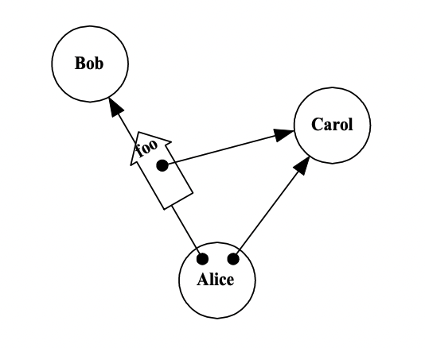
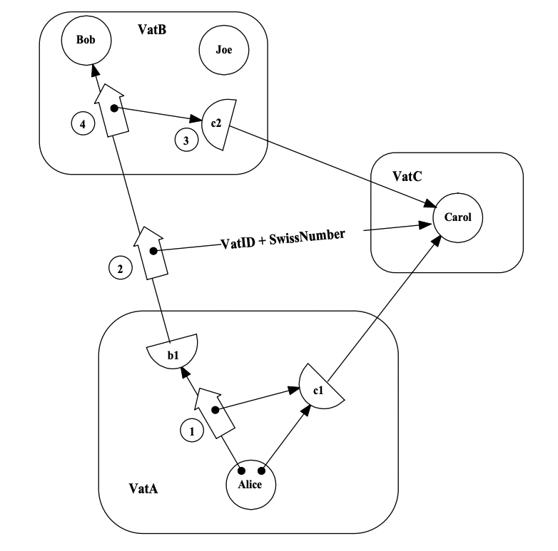

# Capability Based Financial Instruments
Here we will be sharing our notes and thoughts about the
[Capability Based Financial Instruments](https://papers.agoric.com/assets/pdf/papers/capability-based-financial-instruments.pdf)
paper.

For now, I'm dropping raw dump of what I've understood from the paper.

## The Granovetter Operator

The paper is a study that examines the above diagram in the six perspectives below;
* As the basic step of Object Computation.
* As the foundation for Capability Security.
* As a Cryptographic Protocol implementing distributed capabilities.
* As a Public Key Infrastructure, where certificates act like messages, transmitting authorization among the players.
* As the core Game-Rule for secure computation modeled as a vast multi-player game.
* As material from which to build a diversity of Financial Bearer Instruments.

## Rights In A Capability System
Section `6.2` explains the kinds of rights, very useful when we think about `ERTP` and `erights`.

## VAT Communication and E Language

In the section `4.1`, the paper talks about how can a distributed capability based object communication
can be implemented. The half circles indicate a proxy to the actual object and during the creation of a proxy
a series of cryptographic operations takes place, only once. These cryptographic operations are implemented
by `Pluribus`, the crypto layer of `E` language as far as I can understand.

